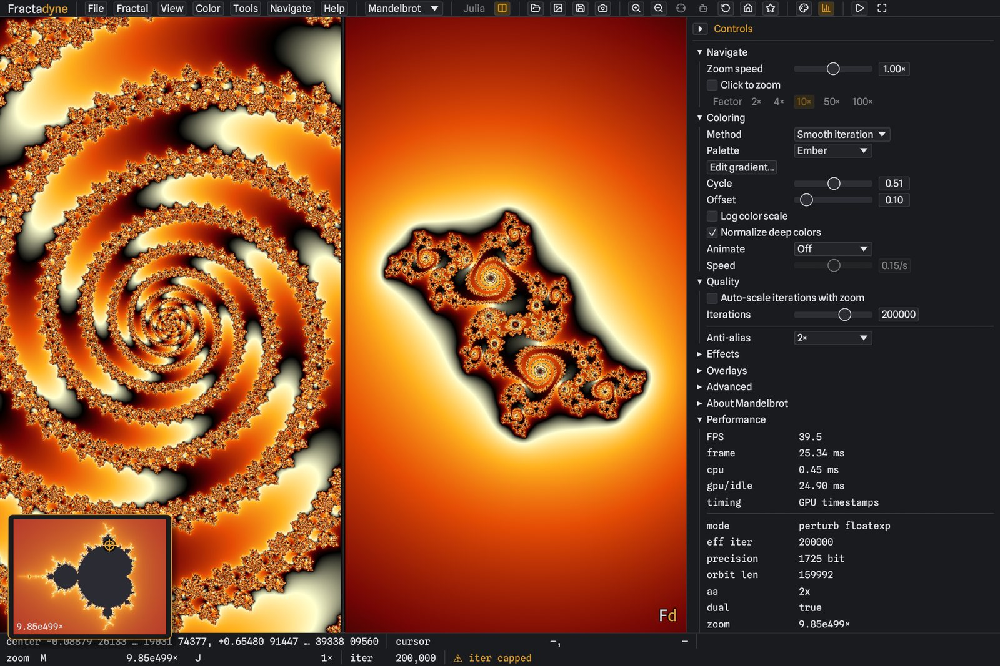

# Fractadyne

A fractal explorer for Windows and Linux in Rust (wgpu + egui/eframe), built for
**ultra-deep zoom** and performance.



<sub>A Misiurewicz (49,3) point at ~1e500x. Regenerate with `fractadyne --shot <location.fdn> --out hero.png --size 1920x1280`.</sub>

## Highlights

- **Extreme deep zoom** — arbitrary-precision center (`astro-float`, or MPFR in the
  [optional accelerated build](#download)), a bignum
  reference orbit, and a GPU perturbation pipeline that switches by depth:
  direct df32 → df32 perturbation → **floatexp** perturbation (df32 mantissa + i32
  exponent), so the deviation never runs out of `f32` exponent range. Zhuoran rebasing;
  depth is bounded by coordinate precision and the iteration budget, not a fixed wall —
  renders match **Fraktaler-3** across a 38-location reference corpus up to **~1e1105×**
  (pixel-exact against F3's raw iteration counts where directly comparable) and are
  self-consistency-validated far deeper (to 1e1000000×); a bundled tour dives to **~1e838×**. **Series
  approximation** (order-3) skips the early iterations of deep Mandelbrot renders by seeding
  the perturbation from a polynomial — validated to reproduce full iteration exactly.
- **Smooth live deep dives** — scripted dives stay fluid to extreme depth: reference-candidate
  scoring fans out across **all CPU cores** (~12–14× faster picks), a **lookahead queue**
  pre-builds the references a tour is about to need on idle cores, the playback clock
  **self-paces** when the pipeline lags (the dive slows instead of blurring), and an adaptive
  motion-resolution controller keeps detail refreshes within a vsync (floor configurable —
  Rendering → *Min motion resolution*).
- **Fractal variety** — Mandelbrot, Multibrot 3/4/5, Tricorn, Burning Ship, Celtic,
  Buffalo, Phoenix, Newton — each with an info panel; Julia mode for any family.
- **Dual linked view** — Mandelbrot ↔ Julia, with click-to-pin Julia `c`.
- **Coloring** — preset palettes, cycle/offset, animated cycling, and harmonious
  randomized morphing gradients. Six methods (smooth, stripe, triangle-inequality, orbit trap,
  distance estimate, decomposition), a custom gradient editor that **imports a pasted palette**
  (hex, or the 0–255 triples Fractint/KF `.map` files use), and two mappings for deep views:
  **normalize** fits the gradient to the escape range actually present, and **log scale** spreads
  it by the logarithm so the palette isn't spent on a thin shell at the boundary.
- **8-bit output without banding** — every PNG is ordered-dithered on the way to 8 bits, so the
  vast smooth gradients of a fractal exterior don't quantize into visible contours. The dither is
  positional, not random, so renders stay bit-identical run to run and the pattern never crawls
  across the frames of a zoom video.
- **Interactive orbit overlay** — draws the iteration path under the cursor (high
  precision at depth), with an optional racing-dot animation and normalized view.
- **Exact feature navigation** — Newton-snap onto the precise center of a **minibrot
  nucleus** (period auto-detected) or a **Misiurewicz point** (parameterized by preperiod
  `k` + period `p`) near the current view, in bignum — then dive arbitrarily deep with zero
  drift. A curated list of well-known Misiurewicz points is one click away
  (Locations → "Go to location…"; nearest minibrot also on **M**).
- **High-res export** — tiled PNG / OpenEXR with reloadable view metadata, a gallery
  browser, background rendering with progress + cancel.
- **Bookmarks** — save and instantly return to favorite (deep) locations.
- **Shareable locations** — copy/paste or save/load a self-contained `.fdn` location
  (File → "Share location…") to reproduce an exact spot/look; hardened, fuzzed parser.
- **Guided tours & movie export** — TOML keyframe scripts with eased camera moves, timed
  captions, coordinate-anchored callouts, and spotlight vignettes (full field reference:
  [TOURS.md](TOURS.md)). Play them live, or render a tour headless to a PNG frame sequence and
  (with ffmpeg) straight to an **mp4**. Deep dives overlap the bignum reference, GPU render, and
  PNG encode across frames for throughput. **Tools → "Script to current view…"** generates a
  ready-to-play dive tour from the full set down to wherever you are (deep targets get the
  proven pan-shallow-then-dive structure; duration defaults from the zoom depth).
- **Watermark & location HUD** — a subtle "Fd" watermark (on by default, toggleable) and an
  optional burned-in zoom/coordinate HUD (`--show-location`) on live view and renders.
- **Tooling** — a built-in benchmark (FPS / CPU / GPU / RAM + system info), with a **standardized**
  mode (pinned resolution + settings, comparable across machines) and a **burn-in** loop for
  stability/thermal checks, plus headless CLI modes (`fractadyne --help` for the full reference).
- **Auto-zoom (autopilot)** — hands-free dive toward detail (the **A** key or the 🛸 toolbar
  button, which stays highlighted while running), with an adjustable **dive limit** slider
  (Navigation panel, 1e30×–1e5000×); past ~1e271× it switches to a stepped dive to reach extreme
  depth. **Esc** stops it.
- **Session & state** — the session auto-saves; **File → Reset application state** (or
  `--reset-state`) wipes the session, bookmarks, and thumbnails after a confirmation. The session
  file is versioned (it warns if written by a newer build), and `FRACTADYNE_CONFIG_DIR` overrides
  where state is stored (portable / sandboxed installs).
- **Restartable renders** — a long `--render-tour` can be resumed with `--resume` (re-renders only
  the missing frames); `scripts/render-spiral-dive.ps1` detects a prior run and offers Resume / Over.
- **Updates & issue reporting** — an in-app update check (Help → "Check for updates", or on
  launch if enabled) against GitHub Releases, with a persisted **Stable / Beta** track choice
  (View → Settings → Updates; a Beta user is always offered the newest of either channel) and a
  direct download link — no auto-install. **Help → "Report an issue…"** pre-fills an email
  (type picker, optional system info, log/`.fdn`/screenshot attach notes).
- **Open-source notices** — the bundled dependency licenses are reproduced in
  `THIRD-PARTY-NOTICES.md` (shipped with each release) and in-app under **Help → Licenses**.

## Download

Prebuilt Windows (x64) binaries are attached to each [GitHub
Release](../../releases) — grab the latest `fractadyne-vX.Y.Z-windows-x64.zip`, verify it
against the accompanying `.sha256` if you like, unzip, and run `fractadyne.exe` (no install,
no toolchain needed). Releases are built automatically from a tagged commit by
[`.github/workflows/release.yml`](.github/workflows/release.yml); tags with a `-` suffix
(e.g. `v0.2.40-beta.1`) publish as **pre-releases** — the app's Beta update track.

### Optional: the accelerated build

Each release also carries `fractadyne-vX.Y.Z-windows-x64-accelerated.zip`. It is the **same
program** computing deep-zoom reference orbits with MPFR/GMP instead of the pure-Rust library,
which is **2.5–6.4× faster** at that step — the CPU pause before a deep view starts
resolving. Extract it and run `fractadyne.exe` from that folder, keeping the `.dll` files beside
it; settings, saved session and locations are shared with the standard build, so you can switch
freely. In the app: **Help → Faster deep zoom**.

The two produce **byte-identical images** — verified across every formula at arithmetic
widths from 64 bits to 132,000 bits, plus the full 38-location deep-zoom corpus. It is a
separate download because MPFR cannot be built with the MSVC toolchain the standard Windows
binary uses, and because GMP/MPFR are **LGPL-3.0-or-later** while Fractadyne is MIT OR
Apache-2.0; keeping them apart leaves the standard build free of those terms. The package ships
both licence texts and links the libraries dynamically so you can replace them.

## Build & run

Requires the Rust toolchain (rustup). **Windows quick start:** from the repo root run
[`./scripts/setup.ps1`](scripts/setup.ps1) — it checks for (and can install) the Rust toolchain +
the MSVC C++ build tools, then does a verification build.

**From nothing at all**, on a machine with no toolchain and no checkout, one command does the whole
job — install the prerequisites, clone, and build:

```powershell
iwr https://raw.githubusercontent.com/WindySnowOwl/fractadyne/main/scripts/windows-build.ps1 -OutFile windows-build.ps1
./windows-build.ps1 -Deps
```

Re-run [`./scripts/windows-build.ps1`](scripts/windows-build.ps1) any time to fetch the latest
`main` and rebuild; `-SelfTest` runs the GPU validation suite afterwards, `-Run` launches the app.
[`./scripts/linux-build.sh`](scripts/linux-build.sh) is the same thing for Debian/Ubuntu.

```sh
cargo run -p fractadyne-app                 # debug
cargo run --release -p fractadyne-app       # release — much faster bignum (recommended for deep zoom)
cargo test -p fractadyne-core               # viewport / numerics unit tests
```

Pinned to egui / eframe **0.31** (wgpu backend). Handy scripts live in [`scripts/`](scripts/):
`render-spiral-dive.ps1` (render the deep-spiral tour to a movie), `render-deepest.ps1` (render the
~1e1108× sample location in `deep-sample.fdn`), and profiling helpers.

### Headless CLI

Run `fractadyne --help` for the complete, always-current reference (the same list shown in
the in-app **Help → Command line** window). The common modes:

```sh
fractadyne --help                            # print the full command-line reference and quit
fractadyne --benchmark [--out report.txt]   # benchmark with current settings; report perf + system info; quit
fractadyne --benchmark-std [--res 720p|1080p|4k|5k] [--burnin N] [--out report.txt]
                                             # standardized benchmark: pinned resolution + settings,
                                             # comparable across machines; --burnin N repeats it (stability/throttle)
fractadyne --render --out img.png [--fractal Mandelbrot --center X Y --zoom M \
           --zoom-log2 L --size W|WxH --ss N --iter K --julia --julia-c RE IM --palette I \
           --method stripe --stripe-freq N --trap point|cross|circle --light --de \
           --show-location]
           # --zoom-log2 L sets magnification 2^L for depths past f64 range (≥ ~1e308×)
fractadyne --render-tour tour.toml --out frames [--fps N --size WxH --height H --ss N \
           --prefix NAME --resume --overwrite --mp4 [out.mp4] --show-location]
           # render a keyframe-tour TOML to a PNG frame sequence (+ optional mp4 via ffmpeg);
           # frames are <prefix>_00000.png (prefix defaults to the script name); prompts before
           # overwriting existing frames unless --overwrite/-y. --resume continues an interrupted
           # render (keeps existing frames, renders only the missing ones). Prints live progress.
fractadyne --find-minibrot --center X Y --zoom M   # print nearby minibrot period + nucleus
fractadyne --selftest [--bless] [--out report.md]  # validation suite; exit 0 = all passed
fractadyne --gputest                                # check this GPU's shader compiler preserves the
                                                    # extended-precision arithmetic deep zoom needs;
                                                    # sweeps every backend, headless (no window/display)
fractadyne --render-iter --out img.exr [view opts] # export raw iteration data (EXR) for review
fractadyne --compare A B [--out heatmap.png]       # diff two renders/EXRs: max/mean Δ + heatmap
fractadyne --import-kfr loc.kfr [--render ...]      # load a Kalles Fraktaler location
fractadyne --crosscheck-f3 raw.exr --center X Y --zoom-f3 Z [--iter K] [--er R]
                                                    # compare a Fraktaler-3 raw EXR's exact
                                                    # iteration counts to our CPU bignum oracle
fractadyne --validate-deep [--out report.md]        # extreme-depth precision self-consistency
                                                    # battery (1e1000 … 1e1000000×)
fractadyne --check-updates [stable|beta]            # check GitHub for a newer release on a track; print + exit
fractadyne --profile [--reps N --regions f.toml --out logs/p.json]
                                                    # dev: time render stages per benchmark
                                                    # region → JSON log (see scripts/profile*.ps1)
fractadyne --bench-matrix [--bless] [--reps N]      # dev: 28-segment path-coverage perf + regression
                                                    # suite vs a blessed baseline (design/bench-matrix.md)
fractadyne --divetest tour.toml [--out log.json]    # dev: headless live-dive perf harness — real-time
                                                    # tour windows per depth band (fps/hitches/refresh)
fractadyne @render.args                             # read the whole command line from a response file
```

Validating a machine end to end (six checks, one bundle to send back — see
[DIAGNOSTICS.md](DIAGNOSTICS.md)):

```sh
./scripts/gpu-validate.ps1 -Label my-gpu          # Windows   (-Quick skips the two long steps)
./scripts/gpu-validate.sh  --label my-gpu         # Linux, works over a bare SSH session
```

## File types

Fractadyne uses **standard extensions** (for editor/tooling interop) except for its own
self-contained *location* format, `.fdn`. App-generated outputs are named predictably — images
carry a `fractadyne_` brand prefix + timestamp; a tour's frames/movie take the tour script's name.

| Purpose               | Ext                                | Produced / consumed          | Notes                                                                                                                  |
| --------------------- | ---------------------------------- | ---------------------------- | ---------------------------------------------------------------------------------------------------------------------- |
| Exported image        | `.png` `.exr`                      | Export, `--render`           | **Reloadable** — embeds view metadata; reopen to return to the spot. In-app default `fractadyne_<Fractal>_<stamp>.ext` |
| Raw iteration data    | `.exr`                             | `--render-iter`              | Four float channels, for review / diffing (no coloring)                                                                |
| Shareable location    | `.fdn`                             | File → Share location        | Compact self-contained text snippet of the exact view + look                                                           |
| Session state         | `.toml`                            | auto (config dir)            | `session.toml` — persisted preferences, bookmarks                                                                      |
| Keyframe tour         | `.toml`                            | `--render-tour`, Play script | Guided-tour script — schema in [TOURS.md](TOURS.md); examples in `tours/`                                              |
| Profiling regions     | `.toml`                            | `--profile --regions`        | Benchmark region list                                                                                                  |
| Response file         | *any text* (`.args` by convention) | `@FILE`, `--args-file`       | Command-line arguments in a file                                                                                       |
| Tour frames           | `.png`                             | `--render-tour`              | `<prefix>_00000.png` (prefix defaults to the tour name)                                                                |
| Tour movie            | `.mp4`                             | `--render-tour --mp4`        | `<prefix>.mp4` via ffmpeg                                                                                              |
| Benchmark report      | `.txt`                             | `--benchmark[-std] --out`    | FPS/CPU/GPU/RAM + system info (+ pinned settings for standardized)                                                     |
| Validation report     | `.md`                              | `--selftest`                 | `validation/report.md`                                                                                                 |
| Profile log           | `.json`                            | `--profile`                  | Per-stage timings under `logs/`                                                                                        |
| Kalles Fraktaler loc. | `.kfr`                             | `--import-kfr`               | External location import                                                                                               |

## Validation

Correctness is checked at two layers (no external data — everything is exact mathematics
or internal cross-checks):

- **Numeric ground truth** (`cargo test -p fractadyne-core`) — exact hyperbolic-component
  nuclei & periods, Misiurewicz pre-periodicity, closed-form interior membership, real-axis
  symmetry, and full-precision coordinate round-trips.
- **GPU render validation** (`fractadyne --selftest`, exit code 0/1) — the perturbation
  path is checked against an independent **CPU f64 dwell** and **arbitrary-precision
  (bignum) dwell** (including at extreme depth beyond f64's reach), plus **floatexp vs
  df32** agreement, render symmetry, interior/exterior presence, and NaN/finiteness.
- **Golden-image regression** — `fractadyne --selftest --bless` records reference PNGs
  under `validation/golden/`; later runs diff against them. Every run writes a readable,
  verifiable report to `validation/report.md` with full provenance (version, GPU, CPU,
  OS), per-check parameters/thresholds/verdicts, golden checksums, and the exact
  `--render` command to reproduce each reference — so anyone can independently confirm.
  The blessing GPU is recorded alongside the images: on that card the comparison is strict,
  and on any other it uses a wider, measured tolerance, because cross-vendor floating point
  legitimately disagrees and a check that cries wolf on every other GPU teaches people to
  ignore it.
- **Validation on your own hardware** — **Help → "Diagnostics…"** runs the self-test and the
  UI test from the interface, streams progress, and can attach the result to an issue report,
  so a bug report carries a machine-validated verdict rather than only a description. For a
  full sweep, `scripts/gpu-validate.ps1` / `.sh` run six checks in a fixed order and leave a
  single bundle to send back — the same steps and file names on Windows and Linux, run against
  a private config directory so results are comparable between machines and nobody's settings
  are touched. See [DIAGNOSTICS.md](DIAGNOSTICS.md).
- **External checkability** — a committed location catalog (`validation/catalog.toml`)
  of full-precision coordinates with known answers; raw-iteration **EXR export**
  (`--render-iter`) so a reviewer can diff iteration data against their own renderer,
  free of any coloring confound; **`--compare A B`** (max/mean Δ + difference heatmap)
  for A/B against another build or imported data; and **Kalles Fraktaler `.kfr` import**
  (hardened, fuzzed parser) so the *identical* coordinate can be loaded into a trusted
  third-party renderer (Fraktaler-3 / Kalles Fraktaler) and cross-checked.
- **Cross-renderer cross-check** — `--crosscheck-f3` compares **Fraktaler-3**'s raw
  iteration EXR (its `N` channel) against our independent arbitrary-precision CPU dwell
  oracle, pixel for pixel. Two fully independent engines agree on **100%** of
  interior/exterior membership and **100%** of exterior escape counts to within one
  iteration — undiminished at 10⁶× zoom. Since `--selftest` checks our GPU pipeline
  against that same oracle, the two compose transitively. See
  [validation/crosscheck-fraktaler3.md](validation/crosscheck-fraktaler3.md) to reproduce.
- **Extreme-depth precision validation** — `--validate-deep` exercises the
  arbitrary-precision arithmetic core at magnifications far beyond `f64` range, up to
  **10⁶ ᵈⁱᵍⁱᵗˢ of zoom (1e1000000×, ~3.3-million-bit precision)**, via precision-doubling
  self-consistency + coordinate round-trip. Feasible because `astro-float` uses FFT
  multiplication (~32 ms/iteration even at 3.3 M bits) and the check is single-point, not
  per-pixel. (A per-pixel oracle isn't feasible that deep.) See
  [validation/extreme-depth.md](validation/extreme-depth.md).

## Controls

- **Pan** left-drag · **Zoom** wheel (cursor-centered) · **Box-zoom** right-drag or Shift+drag
- **Continuous zoom** hold Space (in) / Shift+Space (out) · **Click-to-zoom** optional 🎯 tool (left-click dives into the point by a set factor, right-click backs out; drag still pans)
- **A** auto-zoom (autopilot) · **M** find nearest minibrot · **Ctrl+S** quick-save · **★** bookmark · **🏠** zoom-home · **Backspace** undo view · **Esc** stop / exit fullscreen
- **Go to a feature** — Locations → "Go to location…": jump to a well-known point, or Newton-snap onto an exact **Misiurewicz** (preperiod, period) / **minibrot** center near the view.
- Menus grouped by intent: **File** (open/export/share/snapshot), **View** (display + Settings incl. update track), **Locations** (go-to / famous / find), **Tools** (benchmark / autopilot / play script / script to current view), **Bookmarks** (with inline thumbnails), **Help** (help / report an issue / check for updates). Right panel: **Coloring · Effects · Rendering · Navigation · Performance**.

## Layout

Cargo workspace under `crates/` (6 crates): `fractadyne-core` (numerics / viewport),
`fractadyne-gpu` (wgpu pipelines + WGSL shaders), `fractadyne-color` (palettes),
`fractadyne-state` (session / bookmarks), `fractadyne-export` (PNG/EXR + reloadable metadata), and
`fractadyne-app` (the binary — app logic, UI split under `src/ui/`, scripting, CLI, all in modules).
Render orchestration (tile scheduler / cache) is planned to become its own crate one day; that logic
currently lives in `fractadyne-app`. (The earlier stub crates were retired rather than left empty.)

See [ARCHITECTURE.md](ARCHITECTURE.md) for the system as built (authoritative),
[DESIGN.md](DESIGN.md) for the original design intent, and [UI-DESIGN.md](UI-DESIGN.md),
[TODO.md](TODO.md), [CHANGELOG.md](CHANGELOG.md) for details.

## License

Licensed under either of

- Apache License, Version 2.0 ([LICENSE-APACHE](LICENSE-APACHE))
- MIT license ([LICENSE-MIT](LICENSE-MIT))

at your option.

### Third-party components

Fractadyne is distributed as a statically-linked binary that includes many open-source
Rust crates and bundled fonts. Their license texts and attributions are reproduced in
[THIRD-PARTY-NOTICES.md](THIRD-PARTY-NOTICES.md) (generated with `cargo-about`) and are also
viewable in-app under **Help → Licenses**. One dependency (`option-ext`) is MPL-2.0; its
unmodified source is at <https://crates.io/crates/option-ext>. The algorithms and prior art
Fractadyne builds on are credited under **Help → Acknowledgments**.

Toolbar and menu icons are [Lucide](https://lucide.dev/) (ISC), bundled as a subset containing
only the icons the UI uses — regenerate with `scripts/subset_lucide.py`.

The optional [accelerated build](#optional-the-accelerated-build) is the one exception: it
additionally ships GMP and MPFR, which are **LGPL-3.0-or-later**. That package carries its own
licence texts and links those libraries dynamically so they can be replaced. The standard
download contains none of it.

### Contribution

Unless you explicitly state otherwise, any contribution intentionally submitted for
inclusion in the work by you, as defined in the Apache-2.0 license, shall be dual
licensed as above, without any additional terms or conditions.
