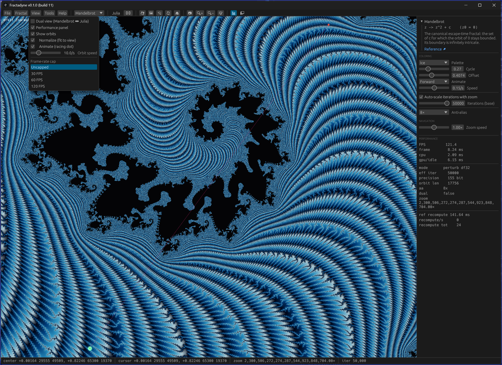

# Fractadyne

A native Windows fractal explorer in Rust (wgpu + egui/eframe), built for **ultra-deep
zoom** and performance.



## Highlights

- **Unlimited deep zoom** — arbitrary-precision center (`astro-float`), a bignum
  reference orbit, and a GPU perturbation pipeline that switches by depth:
  direct df32 → df32 perturbation → **floatexp** perturbation (df32 mantissa + i32
  exponent), so the deviation never runs out of `f32` exponent range. Zhuoran rebasing;
  depth bounded only by coordinate precision and the iteration budget.
- **Fractal variety** — Mandelbrot, Multibrot 3/4/5, Tricorn, Burning Ship, Celtic,
  Buffalo, Phoenix, Newton — each with an info panel; Julia mode for any family.
- **Dual linked view** — Mandelbrot ↔ Julia, with click-to-pin Julia `c`.
- **Coloring** — preset palettes, cycle/offset, animated cycling, and harmonious
  randomized morphing gradients.
- **Interactive orbit overlay** — draws the iteration path under the cursor (high
  precision at depth), with an optional racing-dot animation and normalized view.
- **High-res export** — tiled PNG / OpenEXR with reloadable view metadata, a gallery
  browser, background rendering with progress + cancel.
- **Bookmarks** — save and instantly return to favorite (deep) locations.
- **Tooling** — keyframe camera scripts, a built-in benchmark (FPS / CPU / GPU / RAM +
  system info), and headless CLI modes.

## Build & run

Requires the Rust toolchain (rustup).

```sh
cargo run -p fractadyne-app                 # debug
cargo run --release -p fractadyne-app       # release — much faster bignum (recommended for deep zoom)
cargo test -p fractadyne-core               # viewport / numerics unit tests
```

Pinned to egui / eframe **0.31** (wgpu backend).

### Headless CLI

```sh
fractadyne --benchmark [--out report.txt]   # run a fixed deep-zoom tour; report perf + system info; quit
fractadyne --render --out img.png [--fractal Mandelbrot --center X Y --zoom M \
           --size W --ss N --iter K --julia --julia-c RE IM --palette I]
```

## Controls

- **Pan** left-drag · **Zoom** wheel (cursor-centered) · **Box-zoom** right-drag
- **Continuous zoom** hold Space (in) / Shift+Space (out)
- **Ctrl+S** quick-save · **★** bookmark · **🏠** animated zoom-home · **Esc** exit fullscreen
- Toolbar + menus for fractal, Julia/dual, coloring, export, bookmarks, tools.

## Layout

Cargo workspace under `crates/`: `fractadyne-core` (numerics/viewport),
`fractadyne-gpu` (wgpu pipelines + WGSL shaders), `fractadyne-color`,
`fractadyne-state`, `fractadyne-export`, `fractadyne-app` (the binary).

See [DESIGN.md](DESIGN.md), [UI-DESIGN.md](UI-DESIGN.md), [TODO.md](TODO.md),
[CHANGELOG.md](CHANGELOG.md), and [STATE.md](STATE.md) for details.

## License

Licensed under either of

- Apache License, Version 2.0 ([LICENSE-APACHE](LICENSE-APACHE))
- MIT license ([LICENSE-MIT](LICENSE-MIT))

at your option.

### Contribution

Unless you explicitly state otherwise, any contribution intentionally submitted for
inclusion in the work by you, as defined in the Apache-2.0 license, shall be dual
licensed as above, without any additional terms or conditions.
