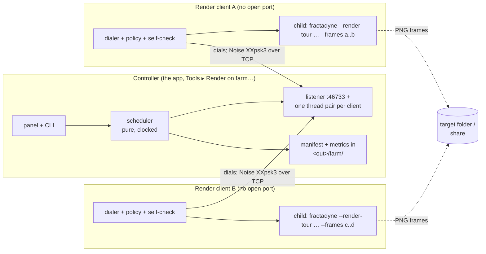

# Remote rendering — design

Status: **Phases 0–3 built (2026-10-04, branch `feat/remote-rendering`), each with its evidence in §12; Phase 4 not started. Every decision in §13 taken by the user on 2026-10-03.**
Written 2026-10-03 at the user's request ("design an implementation that is secure, performant,
scalable and friendly"). Integration facts are from this tree at `3201b74`; every cost figure is
quoted from code, logs or an existing design doc, with its source. The user's decisions, and the
trade-offs behind the three that needed explaining, are in §13.

## ⛔Read this first: what already exists, and a stance this reverses

**TODO.md ("Distributed / multi-machine rendering (analysis 2026-08-10)", lines 9041–9092)
decided the opposite of this document:** a render farm should be *a documented script, not a
subsystem*; "in-app cluster orchestration stays OUT … discovery/scheduling/fault-tolerance is a
permanent tax." DESIGN.md §1.4 lists networking as a non-goal. The user has now asked for the
in-app version — controller, clients, heartbeats, reallocation, resume. This design takes that as
decided and spends its effort on **bounding the tax** the earlier analysis feared:

- the render path does not change — a client renders frames with the same `--render-tour` child
  process the GUI's *Render script…* dialog already launches (`ui/tour_render.rs:4–14` gives the
  three reasons that was right: device loss cannot kill the session, it is the tested path, no
  refactor);
- the scheduler is a pure module with an injected clock, tested the way `segment_range` is
  (`scripting/segment_props.rs`, `scripting/order_tests.rs`), never against a GPU;
- the protocol is a closed list of message kinds — 15 as built in Phase 1, 17 since Phase 3 added
  orbit sharing — all enumerated in §4, and nothing else.

Everything the farm needs that is *already built* — reuse it, do not sit beside it:

| exists | where | what the farm does with it |
|---|---|---|
| frame ranges that tile exactly | `segment_range` `scripting.rs:1091`, `--segments N --segment-index K --dry-run` | the seed partition across clients (§5) |
| `--resume` with structural vetting of the newest frames | `prepare_resume` `scripting.rs:3012`, `png_frame_size` `:364` | the per-folder truth; the farm adds a manifest over it (§6) |
| order-independent palette normalization | time-keyed anchors `scripting.rs:3349–3414`, `norm_anchor_range` `:1069` | measured ONCE and shipped in the bundle (§9) |
| child-process render with stdout progress | `start_tour_render` `ui/tour_render.rs:573`, `parse_frame_progress` `:34` | the client's worker is this, plus a per-frame line (§10) |
| `render-status.txt` in the output folder | `write_render_status` `scripting.rs:459` | kept; the farm's status lives next to it |
| versioned, digest-checked reference-orbit blob | `render/orbit_blob.rs` (`FDNORBIT` v2), `refcache_persist.rs` | the unit of shared computation, unchanged (§8) |
| retry policy for a vanished destination | `write_retry_policy` `fractadyne-export/src/lib.rs:469` | both output modes write through it |
| task invocations: no relaunch, no autosave, cache off | `TASK_FLAGS` `main.rs:715`, `is_task_invocation` `:710` | farm children are task invocations with `--orbit-cache` |
| build identity | `version_string()` `sysinfo.rs`: version, build seq, `FRACT_GIT` (+`-dirty`) | the version gate (§9) |
| free disk space per path | `sysinfo::free_disk_bytes` (Windows `GetDiskFreeSpaceExW`, Unix `statvfs`) | the storage monitor (§11.1) |
| TLS stack already linked | `ureq` → `rustls` + `ring` + `webpki-roots` (update check) | SHA-256 and the Noise primitives without new crypto crates |
| a remote job runner with the right security instincts | `scripts/field-agent.ps1`: parameters not commands, allow-listed flags, hash-verified builds, per-run config dir, idle-only, never kills what it did not start | the client's policy model, in Rust (§3, §10) |

Not reused, deliberately: tiling one image across machines (TODO's recorded anti-pattern — FP32 is
not bit-compatible across GPUs, seams land on filaments). The unit of work is a **frame**.

## 1. Goals and non-goals

The user's requirements, numbered so the sections below can point at them:

1. An app instance can be put in **render client** mode: accept a key and the controller's
   address, connect, wait for requests, render frames. (Decided 2026-10-03: the *controller*
   listens and shows its address and port; clients dial it — §13.3.)
2. Results either **stream back** to the controller or are **saved to a preconfigured share**.
3. The controller **adds clients**, **monitors** them with heartbeats, flags them
   inactive/unreachable.
4. **Timeouts**: a frame not returned in time is **reallocated**.
5. **Shared computation** when shipping it over the network beats recomputing it.
6. The controller **chooses the script**, shows **live status and progress**, can **resume**.
7. The controller **enforces versioning** on clients.
8. **Palette and formula** information is shared.
9. **Status is tracked in the target folder** so a render can resume from the folder alone.
10. **Secure, encrypted, key exchange**; validate every message; permit only what rendering needs.
11. Clients **display activity** and can **cancel**; the controller detects it and accounts for it.
12. Primarily a **LAN** feature; secure practices regardless.
13. (2026-10-03) The controller **monitors free storage** where it can and keeps **performance
    metrics** — frames/s, KB/s over the network, and the like.
14. (2026-10-03) **Diagnostics are helpful**, and a **quick self-check of the client is part of the
    handshake**.
15. (2026-10-03) **Every frame is verified**; a bad frame is reallocated; a client that produces
    several bad frames is **flagged and removed** from the pool, with a notification and
    diagnostics.

Non-goals (this design): WAN/NAT traversal or relays; accounts; splitting one image across GPUs;
distributing the live view; Life tours (there are none — `scripting.rs` has no Life keys).

## 2. The shape



One paragraph: the **controller** is the app with a tour loaded, exactly as the *Render script…*
dialog is today, except that instead of one child process on this machine it hands contiguous
**runs** of frames to **clients** over authenticated, encrypted TCP connections that the clients
open to it. A **client** is the app in render-client mode: given the controller's address and the
farm key it dials in, proves it holds the key, passes a quick self-check, and renders each run as a
`--render-tour` child process in its own throw-away config directory, reporting every finished
frame — which the controller verifies before it counts. Frames travel back
over the connection or are written by the client to a share both sides can see. Everything the
controller knows about the job is written under `<out>/farm/`, so a controller that crashes, or
is closed, resumes from the folder.

Threading follows the codebase (ARCHITECTURE.md §13: plain `std::thread` + `mpsc`, no async
runtime): one reader and one writer thread per connection, blocking sockets with read timeouts,
results into an `mpsc` the UI thread drains in `update()`. Tens of clients cost tens of threads;
nothing here needs tokio, and importing a runtime for this would be the "permanent tax" in
dependency form.

## 3. Trust model and security (requirement 10, 12)

**What changes in the threat model.** SECURITY.md today: parsers for shared files are the attack
surface; `local/…remediation-plan-2026-09-14.md:47`: "no server, no network service". A controller
whose farm panel is listening *is* a network service — the only one: **clients make outbound
connections and expose no port**, the property the field agent was built around ("the test machine
accepts no inbound connection of any kind"). The listener is **off by default**, exists only while
the farm panel is listening, and binds a port the user sees. SECURITY.md gets a paragraph saying so,
with the surface below.

**Assumptions.** The LAN may carry hostile or compromised devices (a guest laptop, an IoT box). An
attacker can sniff, inject, replay and connect. An attacker does **not** have the farm key or a
local account on either machine (that is out of scope, as SECURITY.md already says).

**Pairing (the key the user asked for).** The controller generates a 256-bit **farm key** once
(`ring::rand`), shown as grouped base32 (`fdn1-…`, 52 characters, copyable; a QR code is a §12
nicety). The user types or pastes it, with the controller's address and port, into each client. The
key is the Noise pre-shared key below; nothing else is ever typed. **Admission is the key**: a
client that completes the handshake and its self-check appears in the controller's table and gets
work; an optional *approve new clients* switch holds it at *waiting for approval* instead. Rotate =
generate a new one and re-enter it; every pinned client is then re-verified at its next handshake.

**Channel.** `Noise_XXpsk3_25519_ChaChaPoly_SHA256` via the `snow` crate (Apache-2.0 OR MIT;
confirm with `cargo about`), with its `ring` resolver so the primitives are the ones already linked
for the update check. Why Noise and not TLS: rustls has no PSK suites, so a shared secret would need
its own authenticated step bolted beside the certificates, and certificates on a LAN farm are
paperwork with no issuer. The client is the Noise initiator (it dials); XX exchanges both sides'
static keys inside the encrypted handshake;
`psk3` mixes the farm key into the final message, so **a party without the farm key cannot
complete the handshake, and a passive observer learns nothing, including the static keys** (an
ACTIVE party without the key does learn the controller's static public key from message two —
public by definition — and nothing else). After the first successful handshake each side **pins the
other's static key** (fingerprint shown in both UIs); a later handshake under the same name with a
different static key is refused and reported ("PLUTO changed identity"). The controller pins a
client by its NAME (clients dial from addresses that change); a client pins the controller by the
address it dials.
⛔**A client judges its pin only after the first authenticated message** — the controller's verdict,
which only a holder of the farm key can produce. With `psk3` the controller's static key arrives in
message two, before any proof; pinning there let a keyless impostor at the controller's address get
ITS identity pinned, and the real controller was then refused as "changed identity". Found by a
Phase 1 scenario test (an impostor controller, then the real one, at one address), fixed before any
release. Noise gives per-message authentication, nonces
(no replay), and forward secrecy from the ephemeral keys. Static keys are generated per install
and stored with the farm key in `<config_dir>/farm/` (never logged; `zeroize` is already linked).

**Framing.** `u32 BE length` + one Noise transport message (≤ 65 535 B). Inside: one byte of
kind — `0x01` control, `0x02` blob chunk — then the payload. Control payloads are JSON
(`serde_json` is already linked; readable in logs; the repo's parsers are JSON/TOML already), each
message **≤ 64 KiB**, parsed with every field range-checked exactly as `.fdn` and tour parsing do
(SECURITY.md's own list: size-bounded, allow-list, clamped, unknown keys ignored, no paths or code
executed). Blob chunks are `u64 blob_id, u64 offset, bytes`; a blob is announced first with its
length (≤ 256 MiB) and SHA-256, and is complete only when the digest matches. Any framing or
validation violation closes the connection and flags the peer *protocol error* — no partial trust.

**Authorization = the protocol surface.** There is no command channel. A client can be asked to do
exactly what §4 lists and nothing else; the message kinds are the allow-list. Specific rules:

- ⛔**No path ever crosses the wire as a path.** The client's output root (share mode) and its
  config directory are local settings. The controller sends a `job_id` and a `prefix`, both
  validated against `[A-Za-z0-9_-]{1,64}`; the client builds every path from those and the frame
  index (`<root>/<job_id>/<prefix>_NNNNN.png`). The controller likewise never uses a client-sent
  path: `FrameDone` carries an index, a size and a digest, and the controller computes where that
  frame lives.
- **Scripts arrive as text** and go through `parse_tour_text` — the hardened, fuzzed parser. The
  job overrides `[render].out`, `prefix` and `mp4`; the client ignores the script's own.
- **Formulas are formula source** (the keyframe `formula` string), compiled by
  `CustomFormula::compile` → the app's own WGSL generator. The app never accepts WGSL from a file
  today (confirmed: nothing in the formula, library or dialog code reads it), and the farm keeps it
  that way. Palettes are the script's `[[palette]]` stops/presets. Both ride inside the script —
  requirement 8 costs no new format.
- **Settings arrive as a typed `RenderSettings`** (§9), never as a `session.toml`. The client
  writes a fresh `SessionState::default()` with those fields applied into the job's own
  `FRACTADYNE_CONFIG_DIR`. A raw session file would let a controller set anything the session
  stores.
- **Tunable overrides** are allow-listed by `tunables::OVERRIDABLE` and passed as `--set`
  arguments, which `apply_overrides` already validates (unknown name = fatal).
- **Client policy caps** (settable in the client UI, enforced before any child starts): max frame
  width/height (default the device cap, at most 16 384), max `ss` (default 4), max `max_iter`
  (default `MAX_LOAD_ITER` = 10 M), max run wall time (default none), output root required for
  share mode, optional *only when nobody is using this machine* (the field agent's idle rule).
  A request outside policy is refused with `RunAborted{Policy}` and the reason, not clamped.
- **Resource limits** (all on the controller's one listener). One connection per pinned client;
  FAILED handshakes rate-limited (3 per 10 s per source address, then a 60 s cooldown — successful
  ones never count, so several clients behind one address cannot lock each other out); 10 s
  handshake deadline; 30 s read timeout between messages; at most 2 runs assigned per client
  (current + next); a refused or dropped client redials with backoff (2 s → 60 s), never tighter.
- **Diagnostics never widen the surface.** `DiagRequest` names items from a fixed list (child log
  tail, handshake record, recent heartbeats) and every item has a size cap; a client never sends a
  file the controller names, and never anything from outside the job directory.
- **Logging.** Fingerprints are logged as their first 8 characters; keys never. The diagnostics
  bundle redacts `farm/`.

**What a compromised client could still do:** return a wrong picture. The channel authenticates
*who*, not *what*. §7's verification of every frame catches corruption, §9's probe and spot
re-render catch a client that renders differently, and two strikes remove it (§5); a client that
lies *consistently and plausibly* is the "attacker already controls the machine" case SECURITY.md
excludes.

## 4. Protocol (requirement 7 lives here too)

The protocol version is checked once, in `Hello` / `HelloAck` (both ends run one commit, so a
per-message version would only repeat it). As built in Phase 1 the job's parameters — size, fps,
ss, prefix, frame count, orbit cap — travel in the bundle, so `Assign` is just job, run and range;
unknown fields are refused rather than ignored. K = client, C = controller; the client dials and
speaks first. 15 kinds in Phase 1; Phase 3 added the two orbit messages (protocol 6 — 2 to 5
carried the probe, the driver, `Cancel.from` and `FrameDone.on_share`). The orbit query designed
here was not needed: a render finds an admissible orbit in its own cache, so the controller pushes
its pool instead of answering for one view:

| direction | kind | payload (all fields validated) | cap |
|---|---|---|---|
| K→C | `Hello` | `app_version`, `git`, `protocol`, client name, fingerprint, `gpu {adapter, backend, driver, max_storage_binding, max_texture_dim}`, `gputest` class, `policy` caps, `tunables` status line, `slots`, `clock` | 16 KiB |
| C→K | `HelloAck` | controller identity, verdict (`admitted` / `waiting for approval` / refused + reason), which self-check items to run | 8 KiB |
| K→C | `SelfCheck` | §9.1: per-item pass/fail + detail — device, child launch, output root, free space, built-in probe digest, link sample | 16 KiB |
| C→K | `JobOpen` | `job_id`, bundle digest, bundle length (the bundle follows as a blob: script text, `RenderSettings`, normalize anchors, `--set` list) | 64 KiB + blob ≤ 16 MiB |
| C→K | `Assign` | `job_id`, `run: [start, end)`, `size`, `fps`, `ss`, `prefix`, output mode, `stall_timeout_s`, `deadline_s` | 4 KiB |
| C→K | `Cancel` | `job_id`, `run` or `*`, reason (`Reassigned`, `Paused`, `Stopped`) | 1 KiB |
| C→K | `JobClose` | `job_id` | 1 KiB |
| C→K | `OrbitPush` | *(Phase 3)* `job_id` + blob announcement: an orbit from the farm's verified pool, for the client's job cache | 4 KiB + blob ≤ 256 MiB |
| K→C | `Heartbeat` | every 2 s: state, `job_id`, `run`, frames done in run, current frame index, frame started at, child pid alive, load, free bytes at output root / temp | 2 KiB |
| K→C | `FrameDone` | `job_id`, `run_id`, `index`, blob announcement (`bytes`, `sha256`), `on_share` (no chunks follow; the controller reads it on the share), `render_ms`, `reference` (`fresh` / `cache` / `reused` / `none`) | 1 KiB |
| K→C | `FrameFailed` | `job_id`, `index`, class (`Encode`, `Storage`, `Deadline`, `Gpu`), message (≤ 1 KiB) | 2 KiB |
| K→C | `RunAborted` | `job_id`, `run`, done-up-to, reason (`UserCancel`, `Paused`, `DeviceLost`, `ChildCrash{exit}`, `Policy{what}`, `Version`) | 2 KiB |
| K→C | `OrbitOffer` | *(Phase 3)* `job_id` + blob announcement: an orbit the client's renders built and cached (≥ 1 s to build) | 4 KiB + blob ≤ 256 MiB |
| C→K | `DiagRequest` | items from a fixed list (`child_log_tail`, `handshake`, `heartbeats`) | 1 KiB |
| K→C | `DiagReport` | the requested items, each truncated to its stated cap | 64 KiB |
| C→K | `Keepalive` | every 5 s; a client whose read times out (30 s) knows the controller is gone, not quiet | — |
| either | `Bye` | the sender is closing on purpose, and why (a removal, a refusal, a client leaving) — a client told `Bye` stops; one whose connection merely drops redials | 1 KiB |

Blobs (bundle, frames, orbits) are the only large payloads and all go through the chunk kind with
an announced length and digest.

```mermaid
sequenceDiagram
  participant K as Controller
  participant C as Client
  C->>K: TCP connect, Noise XXpsk3 handshake (client initiates; farm key as PSK)
  Note over K,C: both pin the other's static key on first contact
  C->>K: Hello (version, git, protocol, GPU, policy, tunables)
  K->>C: HelloAck (identity, admitted, self-check list)
  C->>K: SelfCheck (device ✓ · child ✓ · root ✓ 412 GB · probe 0 px · link 940 Mb/s)
  Note over K: refuse unless version+git+protocol+stock match and hard checks pass (§9)
  K->>C: JobOpen + bundle blob (script, settings, anchors)
  K->>C: Assign run [120, 136)
  loop every 2 s
    C->>K: Heartbeat (frame 123, started 14 s ago)
  end
  C->>K: FrameDone 120 (+ frame blob when streaming)
  K->>C: Assign run [136, 152)  (depth-1 prefetch)
  C->>K: RunAborted [120,136) done-up-to 129, UserCancel
  Note over K: 129..136 back to the queue; client → Paused by user
```

## 5. Scheduler (requirements 3, 4, 6, 11)

A pure state machine in `fractadyne-farm::sched`: `fn step(&mut self, now: Instant, ev: Event) ->
Vec<Command>`. Events: client joined/left/heartbeat, frame done/failed, run aborted, user
pause/resume/stop, tick. Commands: assign, cancel, mark client state, write manifest. No I/O, no
threads, no clock of its own — every property below is a unit test with a fake clock, including
"every frame exactly once" across arbitrary reassignments (the property `order_tests.rs` already
pins for a single machine).

**Work unit: a run of contiguous frames, not a frame.** Three reasons, all from the render path as
built: `render_tour_to_dir` builds frame N+1's reference while frame N renders
(`scripting.rs:3283–3510`), L-system tours keep their `BigTables` between frames
(`lsystem_view/export.rs:202–207`), and a `dissolve` transition blends with the preceding frame
(`scripting.rs` — a run boundary inside a dissolve degrades it to a cut, as a shard does today).
Each run is one child process; a child costs 1–2 s to start (window, device, script parse), which
a run of a few minutes amortizes.

**Seed partition = `segment_range(F, n_clients, k)`.** Client *k* starts at the start of shard *k*
and works through it in runs. This reuses the proven tiling function, gives every client a cold
reference at most once at its shard start, and yields a coarse preview across the whole timeline
within the first run — the preview `--order progressive` exists for, without the normalization
caveat that order carries.

**Run length adapts.** First run per client: 8 frames (or the whole shard if shorter). Then target
`run_target_s` (default 240 s) of work: `len = clamp(run_target_s / ewma_frame_s, 2, 64)`. Near the
end, lengths shrink so the last frames do not sit on one slow client.

**Work stealing.** A client with nothing left in its shard takes the tail of the largest remaining
unassigned range; if nothing is unassigned, the controller sends `Cancel{run tail}` to the client
holding the largest in-flight run — the child finishes its *current* frame and exits (`--frames`
lets a run be cut at any index), the tail is reassigned. Run boundaries are moved off dissolve
windows (computed from the script's `transition`/`transition_secs` per keyframe).

**Depth-1 prefetch.** The next run is assigned while the current one renders, so a client never
idles on the round trip; at most two runs are ever outstanding per client.

**Heartbeats and reachability.** Clients send `Heartbeat` every 2 s. Five missed (10 s) → the client
is **unreachable**: its in-flight runs go back to the queue immediately (any verified `FrameDone`
stays done) and the connection is dropped. The **client** redials with backoff (2 s → 60 s) — it is
the dialling side — and on reconnect repeats the handshake and self-check (§9.1) before it is
offered work; frames it says it finished while away (share mode) are accepted after verification.

**Timeouts — two rules, because one is wrong for deep zoom.** A frame at 1e60205× legitimately
takes an hour on the reference alone, so a fixed per-frame deadline would reassign honest work
forever. (a) **Stall**: a run whose `FrameDone` count has not advanced within `stall_timeout_s`
(default `max(300, 8 × median frame time seen on this job)`) is cancelled and reassigned, and the
client is marked *suspect*. (b) **Hard deadline** per frame (`deadline_s`, default none): the
explicit "not returned within the timeout" rule the user asked for, for farms that want it. Both
are shown in the panel with their defaults. A **late result** for a frame already completed
elsewhere is verified and discarded with a log line; the first completed frame wins.

**Bad frames and strikes** (requirement 15). A **bad frame** is one the controller's verification
rejects — §7: digest, size, PNG structure or dimensions; §9: the content check. It is moved to
`farm/bad/<prefix>_NNNNN.<client>.png` for inspection, **reallocated to a different client**, and
counts one **strike** against the sender. At `strikes_to_remove` (default 2 per job) the client is
**removed from the pool**: its runs are requeued, nothing more is assigned, the connection is
closed with the reason, the panel raises a notification (toast, event-log line, alert tone) and
writes a diagnostics bundle (§11.1) — the client's identity and self-check, the bad frames, its last
heartbeats, and the child log tail fetched with `DiagRequest` while the connection is still up.
Re-admission is manual (*Re-admit* in the table), never automatic on reconnect. A self-reported
`FrameFailed` is not a strike — the client said so itself; two `FrameFailed` for the same frame on
two clients → the frame is marked *failed* and the job continues (the summary lists it; `--resume`
renders it later).

**Other failures.** `RunAborted{DeviceLost|ChildCrash}` → the run
is reassigned, the client stays available but a second device loss within 10 minutes parks it
*unstable — paused* with the reason visible. `RunAborted{UserCancel}` → frames up to `done-up-to`
are kept (their `FrameDone` arrived), the rest requeued, the client goes to **Paused by user**
and gets nothing until its user resumes (requirement 11). `RunAborted{Policy}` → the controller
shows which cap, and stops assigning to that client for this job.

**The controller as a worker too.** Not in-process: the controller spawns a local render client
as a child connected over loopback — the same code path, the same isolation, and the controller's
GPU joins the farm with no second implementation.

## 6. State in the target folder; resume (requirements 6, 9)

```
<out>/
  <prefix>_00000.png …            the deliverable, same names as --render-tour
  render-status.txt               as today (running / complete / canceled / failed)
  farm/
    job.toml                      identity: job_id (= first 16 hex of SHA-256 over script text +
                                  RenderSettings + anchors + app version), script path + digest,
                                  size/fps/ss/prefix, frame count, created, controller fingerprint
    done.jsonl                    append-only: {index, bytes, sha256, client, ms, at} per frame
    events.jsonl                  append-only: assignments, timeouts, aborts, client state changes
    status.toml                   rewritten atomically every few seconds: counts, ETA, per-client
                                  summary, free space — what a second app instance or a script reads
    metrics.jsonl                 one sample every 10 s (§11.1): frames/s, bytes/s per connection,
                                  per-client frame times, queue depth, idle, free space
    bad/                          quarantined frames that failed verification, named by sender
    diag/<client>-<stamp>/        diagnostics bundle written when a client is removed
    orbits/                       shared reference blobs (§8), stream mode only
```

**Resume** = open the folder: `job.toml` must match the script and settings the user chose
(digest equality; a mismatch is refused with both digests, the way `prepare_resume` refuses a
different frame size); every frame in `done.jsonl` is checked for existence and size (digest on
request — `--verify`); frames on disk but **not** in `done.jsonl` (written by a plain
`--render-tour --resume`, or by a client whose `FrameDone` never arrived) go through
`prepare_resume`'s structural check and are adopted. Everything else is pending. The controller
can therefore die at any moment; so can a client (§5).

**Atomic writes, everywhere.** `write_png` calls `File::create` directly and the tour writer
retries-and-deletes but does not rename (`fractadyne-export/src/lib.rs:498`,
`scripting.rs:3184–3282`). The farm adds `<name>.part` → `rename` to the PNG writer for *all*
tour renders — the prerequisite TODO.md:9047 named, closed for the single-machine case too. The
`.part` suffix is excluded by the resume vetter. Rename is atomic on NTFS, SMB and POSIX.

**The known weakness stays named.** `prepare_resume`'s tests record that the PNG decoder accepts a
file truncated by one byte. `done.jsonl` carries a digest precisely so the farm never relies on
structural vetting for frames it wrote itself.

## 7. Output modes (requirement 2)

**Stream** (default, works with no shared storage). The client reads the finished PNG, announces
a blob (length, SHA-256) in `FrameDone{Streamed}`, and sends ~60 KiB chunks. The controller writes
`<prefix>_NNNNN.png.part`, verifies the digest and that the PNG's IHDR is the job's size, renames,
appends to `done.jsonl`; anything else is a bad frame (§5). A 1080p frame is
typically 2–5 MB, a 4K frame 8–20 MB; gigabit Ethernet moves 100–110 MB/s, so a 4K frame costs
~0.1–0.2 s of link time against minutes of rendering. The client deletes its copy after the
controller acknowledges (`Assign` of the next run or `JobClose` act as acks; an explicit `Ack` is
not needed).

**Share.** The client has a local **output root** in its settings (`\\fileserver\share\renders` on
one machine, `/mnt/share/renders` on another — the *mapping* is per machine, which is why the
root never crosses the wire). The child writes directly to `<root>/<job_id>/`, through
`write_retry_policy` (a vanished share is waited on, a full disk is fatal — TODO.md:7636's
classification, already built). `FrameDone{OnShare}` carries size and digest; the controller
verifies **every frame** at its own mapping (decided 2026-10-03): existence and size, PNG structure
and dimensions (`png_frame_size` must return the job's size), and the full SHA-256 against the
digest the client sent. That is one read of each frame — ~0.1–0.2 s per 4K frame over gigabit, on a
verifier thread off the UI, far under any frame's render time. A failure is a bad frame (§5). The
controller's own output folder may *be* the share, in which case nothing is copied.

**Hybrid.** Share mode still streams small things (nothing today; the bundle goes C→K either way).
Orbit blobs in share mode live in `<root>/<job_id>/orbits/` and are indexed, not transferred (§8).

## 8. Shared computation (requirement 5)

**What is worth sharing, in numbers.** The orbit is `Vec<[f32;4]>`, **16 bytes per iteration**
(`reference.rs:54–69`): 1 M iterations = 16 MB, the 7.4 M-sample cap of a large adapter = 118 MB.
On gigabit that is 0.15 s and 1.1 s. What it costs to build:

| view | precision | build | of which | source |
|---|---|---|---|---|
| 4.6e1105× | 3 738 bits | 6.2 s | pick 2.8 s, orbit 1.3 s, SA 2.1 s | `render.rs:651–654` |
| 2.37e4000× | 13 353 bits | 405 s | SA 258 s, pick 114 s, orbit 33 s, BLA 0.4 s | `reference.rs:1730–1735` |
| 9.98e60205× | 200 193 bits | 8 h 52 min cold, **3 s cached** | pick 5.93 h, orbit 2.93 h, BLA 1.5 s | design/orbit-cache.md |

⭐**The pick, not the orbit, dominates at depth — and the blob carries the pick's result** (the
point it chose, its exact mantissa words, the precision, the tail for extension). BLA is O(n) and
cheap (≤ 1.5 s at 1.6 M samples) and depends on colouring settings, so it is rebuilt locally, as
the disk cache already does (`orbit_blob.rs:127–133`). SA is a second full bignum walk and is
*not* in the blob; it is skipped whenever a BLA tree exists (`render.rs:2886–2896`), which is the
deep Mandelbrot/Multibrot/fold case, so the common deep path loses nothing.

**Mechanism: the on-disk orbit cache, with the network as a second shelf.** Nothing in the render
path changes.

1. Every farm child runs with `--orbit-cache` in the job's own config dir. Within a client, in-process
   pipelining plus the disk cache already give reuse across its runs (a cache hit at 9.98e60205×:
   3 s instead of hours).
2. After a run, the client lists new blobs in that cache dir. Any blob whose build took ≥ 1 s (the
   cache's own `ORBIT_CACHE_MIN_BUILD_MS` gate — "worth keeping" is the same question as "worth
   sharing") and is ≤ 256 MiB is announced with `OrbitOffer{key_id, formula_id, julia, prec,
   point words digest, orbit_len, bytes, build_ms}`. In stream mode the controller pulls the blob
   into `<out>/farm/orbits/`; in share mode the client wrote it to `<root>/<job_id>/orbits/` with
   temp-then-rename and the controller only indexes the header.
3. Before launching a run, the client sends `OrbitQuery{first frame's centre words, span, precision,
   formula key}`. The controller evaluates admissibility over its index with the cache's own rule
   (`reuse_drift`: `prec ≥ needed` and the point within `REUSE_MAX_DRIFT` = 0.7 spans of the view
   centre — a pure function of header fields and the view) and replies with the longest admissible
   blob, if **transfer beats build**: `bytes / measured_link_rate < build_estimate`, where the
   estimate is `orbit_len × prec²` scaled by the *requesting* client's own measured constant from its
   past `OrbitOffer{build_ms}` values (first run: assume share — the gate already said ≥ 1 s). The
   client drops the blob into the job cache dir; the existing lookup (`refcache_persist::find`)
   finds it before the pick runs.

**Where it pays.** References flow deep → shallow: a blob built at a deeper frame (higher
precision, point near the centre) is admissible for every shallower frame near the same centre. For
a dive at a fixed centre — most tours in `tours/` — **one** blob at the final keyframe's precision
serves every frame on every client; the "shippable reference files" item (TODO.md:9080) falls out
of this as the special case "the controller pre-builds the deepest keyframe's reference and offers
it first" (an option, default on for tours whose deepest keyframe is past 1e300×).

⚠**Honesty about identity.** A reused orbit at the *same* point and precision is bit-identical to
a fresh one (`selfcheck_orbit_cache`, `render.rs:3030`). A *different* admissible point is a
different, equally valid perturbation reference, and the code notes reuse is "not perfectly
invariant" at extreme depth (`render.rs:1303–1307`): a handful of pixels can differ from an
unshared render. The app's own interactive cache already accepts this. The job setting
`sharing = neighbourhood | exact | off` (default `neighbourhood`) lets a final delivery choose
`exact` (same point and precision only) at the cost of more cold references.

L-systems: `BigTables` are per process and rebuilt per run from the script — seconds, nothing to
ship. Life: no tours.

## 9. One picture from many machines: version, settings, GPU (requirement 7)

Facts first. For `--render-tour`, precision is a pure function of the view (`precision_for_octaves`:
octaves + 64, orbit at +128 headroom) and `max_iter` is a pure function of script + base. But
four inputs are **not** carried by the script, and a farm turns each into a frame-to-frame flicker:

| hazard | where | closure |
|---|---|---|
| **Version skew** | `version_string()`; `publish-share.ps1` refuses dirty builds | `Hello`/`HelloAck`: `APP_VERSION`, `FRACT_GIT` and `protocol` must be equal and `git` must not end in `-dirty` (decided, §13.4). Build sequence number is per machine and is *not* compared. Mismatch → client shown *version mismatch: has 0.3.0-beta.17 g3201b74, farm needs 0.3.0-beta.18 gabcdef0*, no work assigned. Dev override `--farm-allow-dirty`: both sides must pass it, it is logged, written to `job.toml`, and the panel shows *non-reproducible build*. |
| **Tunables** | `--set`, `status_line()`; `--selftest` fails under any override | both sides `stock`, or the job carries the overrides explicitly and every client runs them. Instrument env vars (`FRACTADYNE_REF_ESCAPE_AT` …) count as off-stock and are refused. |
| **Session-derived settings** | colour method, stripe/trap, light, DE, normalize/log palette, interior, SA/BLA/glitch toggles, watermark, animations — `session.toml` (`main.rs:6487–6493`); and `[render].max_iter` falls back to the *session's* `max_iter.max(500000)` when the script omits it (`scripting.rs:3167–3170`) | the controller resolves all of them into **`RenderSettings`** (typed, allow-listed) in the bundle; the client writes a fresh session from `SessionState::default()` + those fields into the job's config dir. Palette and light animation are pinned off (as `--shot` pins them, `shot.rs:120`). |
| **GPU-dependent inputs** | (a) orbit length cap from the adapter's storage-binding limit — ~7.4 M vs ~928 k samples (`init_orbit_len_cap`, `render.rs:471`): a deep non-escaping reference truncates differently per GPU; (b) normalize anchors measured at 480×270 on the local GPU (`scripting.rs:3349–3414`): "cross-GPU escape values differ"; (c) the burned-in watermark, rasterised at 40 points × the display's `pixels_per_point` (measured in Phase 0: captions, callouts and the HUD are NOT scale-dependent — they lay out at `size / ppp`, and a 1.5× and a pinned render were pixel-identical there); (d) FP32 itself: NVIDIA folds the df32 error-free transforms, AMD keeps them (`gputest.rs`, `design/bench-matrix.md:25–45`) | (a) the job's cap = the minimum over connected clients' `HelloAck.gpu.max_storage_binding`, passed to children (`--set ORBIT_LEN_CAP`, built in Phase 0) — ⚠which means the weakest card sets it for everyone: at corpus location 15 (918,520-sample reference) a 100,000 cap changed every pixel, so the panel must show the job's cap and which client set it; (b) anchors measured **once** by the controller (`--dump-norm-anchors`) and shipped in the bundle (`--norm-anchors FILE`) — this also closes TODO.md:9086 "distributed normalize coherence"; (c) farm children pin `pixels_per_point` = 2 (`cli::FARM_PIXELS_PER_POINT`; 2 keeps the mark a downscale up to 8K frames) and rebuild the mark at it; (d) **cannot be closed**, see below. |

**FP32 across vendors.** Byte-identical goldens hold per GPU, not across GPUs (`selftest.rs:42–64`:
strict on the blessing GPU, `GOLDEN_MEAN_CROSS_GPU` informational elsewhere; the "3080 all-black
vs 3070 rich" entry in `release_checklist.py:431` is the extreme). A farm of mixed GPUs will produce
frames that differ at the pixel level, and in a video that is flicker. The design does three
things, none of them pretending otherwise:

1. **GPU classes.** `Hello` reports adapter, backend, driver and the `--gputest` class; the panel
   groups clients by class and says plainly when a job spans more than one.
2. **Probe frame, twice.** At the handshake (§9.1) every client renders a **built-in** probe — a
   fixed Mandelbrot view past 1e30× (so the perturbation path runs) at 256×144, ss 1 — and sends its
   digest and the image; the controller counts **differing pixels** against its own render of the
   same probe (never file bytes — `validation/corpus/generate_corpus.py:23–40`) and shows the count
   in the client row. On `JobOpen` an optional **job probe** (the first keyframe's view at 320×180)
   repeats the comparison with the job's own formula and palette. A `homogeneous` job option
   (default on for final delivery, off for previews) refuses clients whose probe differs.
3. **Content check** (default on): a frame with fewer than `flat_colours` distinct colours (default
   4) where the job's probe had many is *suspect*, not bad — black and flat frames are the known
   failure shape, and two black images compare equal. A suspect frame is re-rendered on another
   client; if the two differ by more than `spot_px` pixels, the first is a bad frame (§5 strike),
   otherwise both are legitimate and the job carries on.
4. **Spot check** (optional): 1 in N frames is rendered twice on two clients and the pixel
   difference is logged — the only way to notice a client that drifts mid-job.

### 9.1 The handshake self-check (requirement 14)

Runs on every connect and reconnect, takes a few seconds, and is shown live in both UIs
("Checking: GPU ✓ · child ✓ · output root ✓ 412 GB free · probe ✓ 0 px differ · link 940 Mb/s").
Hard items refuse admission with the failing item named; soft items are recorded in the client row
and in the diagnostics.

| item | what runs | hard / soft |
|---|---|---|
| version | `APP_VERSION`, `FRACT_GIT` (no `-dirty`), `protocol` equal to the controller's | hard (§9) |
| tunables | `status_line()` is `stock`, no instrument env vars — or exactly the job's overrides | hard |
| device | a wgpu device on the client's chosen adapter (the `run_gputest_sweep` path, windowless); the `--gputest` primitives verdict → GPU class | hard if no device; class is soft |
| child | `fractadyne --version` as a child from `current_exe()` must answer with the same identity | hard (a client whose exe moved or was replaced fails here, not mid-run) |
| output root | share mode: a temp file written, read back and removed under `<root>/` | hard in share mode |
| free space | `free_disk_bytes` at the output root (share) or the temp dir (stream); reported in `Hello` and every `Heartbeat` | soft here; the storage monitor (§11.1) acts on it |
| probe | the built-in probe render, digest + image | soft; differing pixels shown; hard under `homogeneous` |
| link | a 4 MiB blob each way, timed → the link rate §8's cost model uses | soft; a client under 50 Mb/s is flagged |
| clock | skew between `Hello.clock` and the controller's; for log alignment only | soft; shown if > 5 s |

## 10. The client (requirements 1, 11)

**Entering.** *File ▸ Render client…* opens a dialog with two fields — the controller's address and
port, the farm key — and the client's policy (UI-DESIGN §8.2: affirmative first — *Connect* —
Cancel second; while connected the slot becomes *Disconnect*). The client opens **no port**.
Headless (built in Phase 1): `fractadyne --render-client HOST:PORT --farm-key-file F [--name N]
[--max-size WxH] [--max-ss N] [--max-iter N]`; until the dialog exists, creating
`<config>/farm/PAUSE` finishes the current frame and stops taking work (delete it to resume), and
`CANCEL` stops at once and pauses. For a box with no one at the keyboard — with the field agent's caveat intact: a wgpu device needs a desktop session; over
WinRM/SSH on Windows it may land on a software adapter (TODO.md:746–751), so a headless client is
started by a logged-on session (scheduled task "run only when user is logged on"), as the field
agent is.

**What it shows** (the activity the user asked for), in plain words:

- *Not connected — enter the controller's address and the farm key* → *Connecting to
  192.168.1.20:46733…* → *Checking: GPU ✓ · child ✓ · output root ✓ 412 GB free · probe ✓ 0 px
  differ · link 940 Mb/s* → *Connected to "studio-pc" (fingerprint ab12…) — idle* → *Rendering
  deep-spiral-dive, frames 120–135, frame 123 (4 of 16), 2 m 10 s on this frame — 1080p ss2* →
  *Paused by you — the controller has been told* → *Controller unreachable — finishing frame 123,
  then retrying every 60 s* → *Removed by the controller: 2 frames failed verification — see
  Diagnostics*. A refusal says why in the controller's words ("this farm runs 0.3.0-beta.18
  gabcdef0; this client is 0.3.0-beta.17 g3201b74").
- Counters: frames done this session, mean seconds per frame, references built vs received.
- The last finished frame as a thumbnail (read back from the PNG — cheap, and it answers "is it
  rendering the right thing").
- Policy: max size, max ss, max iterations, output root (share mode), *only when idle*, which
  adapter(s).
- Buttons: **Pause** (finish the current frame, then stop taking work — the controller sees
  `RunAborted{Paused}` with done-up-to), **Cancel frame** (kill the child now; `RunAborted{UserCancel}`),
  **Leave** (disconnect, keep the pairing), **Unpair** (forget key and controller — confirms inline,
  Cancel first, as the Reset layout does).

**The worker.** One run = one child: `fractadyne --render-tour <job>/script.toml --out <dir>
--frames a..b --size WxH --fps F --ss S --prefix P --orbit-cache --norm-anchors <job>/anchors.toml
--farm-child [--set …] -y`, with `FRACTADYNE_CONFIG_DIR=<client config>/farm/jobs/<job_id>/`
(fresh session from `RenderSettings`; the job's orbit cache lives there), `FRACTADYNE_NO_SOUND=1`,
`FRACTADYNE_LOG_DIR` inside the job dir. `--farm-child` (built in Phase 0) is the preset: task
invocation, palette and light animation off, sound off, `pixels_per_point` pinned for the
watermark, no visible window, a direct exit after the last frame, and one machine-readable line per
frame once it is on disk: `frame-done index=N bytes=B sha256=HEX ms=M` (the digest is of the file as
read back; a file that cannot be read back is reported `frame-failed index=N reason="…"`). A `ref=`
field (reference built vs received) waits for Phase 3, where the orbit-cache hit is attributable.
⚠Two eframe 0.31 behaviours shaped the preset, both measured: `ViewportBuilder::with_visible(false)`
holds only until the first frame is painted (`post_rendering` then shows the window
unconditionally — `--deviceloss-repro` relies on it and is visible after frame one), so the child
re-hides with `ViewportCommand::Visible(false)`, applied after that show; and a hidden window gets no
further frames, so the `ViewportCommand::Close` an ordinary tour ends with never lands — the child
calls `refcache_persist::drain()` and exits instead. The client's reader thread turns those into `FrameDone`; stderr lines
matching the existing *interesting* filter (`tour_render.rs:623`) become `FrameFailed`/`RunAborted`
messages; a child exit code → `RunAborted{ChildCrash}` (device loss exits are already distinct —
task invocations never relaunch). A new run is launched when `Assign` arrives, so the depth-1
prefetch keeps the GPU busy across the child restart.

**If the controller vanishes**, the client finishes the frame it is on, writes it (share mode) or
holds it (stream mode, up to 15 minutes), stops the child, and **redials with backoff for as long
as it is left in client mode** (2 s → 60 s; a controller that restarts finds its clients come back
by themselves). On reconnect it reports held frames first. Under no circumstance does it keep
rendering a run for nobody — GPU minutes with no one to report to are the one waste a cancel is
for.

## 11. The controller (requirements 3, 4, 6)

*Tools ▸ Render on farm…* — the *Render script…* dialog with a farm section, seeded from the
script's `[render]` block exactly as `open_tour_render` seeds today, so a tour renders as authored.

- **Farm**: **Listen** / Stop listening (interface and port, default all interfaces : 46733; the
  addresses to give clients are shown beside it), farm key (Generate / Show / Copy / Rotate),
  *approve new clients* switch, **client table** — name, address, version (✓ or the mismatch text),
  GPU class, self-check summary, state (*idle · rendering 123 (4/16) · paused by user · unreachable
  37 s · waiting for approval · version mismatch · policy refused: ss 4 > 2 · removed: 2 bad frames
  · protocol error*), last heartbeat age, frames done, mean s/frame, KB/s, differing probe pixels,
  strikes — clients **appear when they connect**; per row *Approve*, *Pause*, *Remove*,
  *Re-admit*, *Diagnostics…*. States are words a person can act on, never codes.
- **Job**: script (the loaded tour), output folder, output mode (stream / share + this machine's
  share root), size/fps/ss, sharing (`neighbourhood/exact/off`), homogeneous, stall timeout,
  hard deadline, spot-check rate, *also render on this machine* (spawns the loopback client), mp4
  at the end (the existing ffmpeg path, run once by the controller).
- **Run**: **Render** / Cancel → while running **Stop** (if/else, one slot), **Pause** / **Resume**.
  Overall progress bar with ETA (completed frames / rate, as `say()` computes), a frame strip
  coloured by state and client (pending · assigned · done · failed), event log tail, and the finish
  tone. **Copy command** gives the equivalent CLI line, as the dialog does today.
- **Resume**: *Open folder…* reads `farm/job.toml`; the dialog shows what is done and what is
  pending before the user presses Render.

CLI, for scripted farms and for the field machines: `fractadyne --farm-render tour.toml --out DIR
--listen 0.0.0.0:46733 --min-clients N [--local] [--share-root R] [--homogeneous] [--stall S]
[--deadline S] [--sharing MODE] [--strikes N] [--resume] [--mp4]` (waits for `N` clients to be
admitted, then starts); `fractadyne --farm-status DIR` prints `status.toml`. Flags enter
`help::CLI_REFERENCE`, which is also what makes them known (`known_long_flags`).

### 11.1 Metrics, storage and diagnostics (requirements 13, 14)

**Metrics.** The controller is the one place every byte and every frame passes, so it measures
rather than asks. Kept as EWMA + totals, shown in a metrics strip in the panel, sampled every 10 s
into `farm/metrics.jsonl` (the `perf.jsonl` precedent) and summarized at the end in `status.toml`:

| metric | how |
|---|---|
| frames/s, job and per client | verified `FrameDone` timestamps |
| KB/s in / out, per connection and total | byte counters on each connection's reader and writer |
| frame time per client: mean, median, last | `FrameDone.render_ms`, and wall time between assignment and arrival |
| references fresh vs reused, per client | the `ref:` field of the `frame-done` line |
| client idle % | time a client spent connected with no run assigned — the scheduler's own efficiency |
| reassignments, stalls, deadlines, bad frames, strikes | event counters |
| queue depth, ETA | pending frames / job frames/s |
| disk: bytes written, free space at the output folder (and the share), per-client free space | `free_disk_bytes` every 10 s; `Heartbeat` fields |

**Storage monitor.** Free space at the output folder is sampled every 10 s with
`sysinfo::free_disk_bytes` — "if possible", as asked: the function returns `None` where the
platform cannot say, and the panel then shows *unknown* rather than a guess. The need is estimated
as `pending frames × EWMA frame bytes`. Thresholds: **warn** (yellow strip, event line) when free
space < 2× the estimated need or < 2 GiB; **pause assignment** when free space < one frame's
estimate + 256 MiB — the job shows *waiting for space*, verified frames keep landing, nothing is
lost, and assignment resumes by itself when space appears. This runs *before* `StorageFull`, which
`write_retry_policy` rightly treats as fatal; the monitor's job is to make that path unreachable in
practice. In share mode the same check runs on the controller's mapping of the share, and a
client's own `Heartbeat.free_bytes` below the threshold pauses *that* client with the reason.

**Diagnostics.** Every client state carries a reason sentence (the table shows it; hovering shows
the full text), and every refusal names the fix. The event log is the tour renderer's `say()`
voice: time, client, what happened, what the controller did about it. *Diagnostics…* on a client
row writes `farm/diag/<client>-<stamp>/` with: `identity.toml` (`Hello`, self-check results, GPU
class, pinned fingerprint), `heartbeats.jsonl` (last 300), `events.jsonl` filtered to the client,
the quarantined frames, and `child-log.txt` fetched with `DiagRequest` — the same bundle a removal
writes automatically. The client dialog has the mirror: its own self-check results, its last child
log, and *Copy diagnostics*. All farm log lines use a `farm` category under `FRACTADYNE_TRACE`, and
the diagnostics bundle redacts `farm/*.toml` secrets as §3 requires.

## 12. Implementation plan, phases and gates

**New crate `fractadyne-farm`** (pure; deps: `serde`, `serde_json`, `snow`, `ring` via snow,
`zeroize`): `proto` (message types, validation, caps), `frame` (length-prefix + chunking),
`channel` (Noise session over `TcpStream`, pinning, rate limit), `sched` (§5), `manifest` (§6),
`names` (`job_id`/`prefix` validation), `orbits` (index + admissibility using `fractadyne-core`'s
`reuse_drift` inputs). App side, module `farm/`: `client.rs` (listener, policy, worker), `controller.rs`
(connections, bundle, loopback worker), `ui/farm_client.rs`, `ui/farm_controller.rs`, CLI flags.
Tests sit in sibling files per CONTRIBUTING.md.

**Phase 0 — render-path prerequisites** (each useful alone, each byte-neutral by construction):
temp-then-rename in `write_png`; `--frames A..B` on `TourRenderConfig` (intersects with
`--segment`/shards like today); `--dump-norm-anchors` / `--norm-anchors`; `--farm-child` preset
(animations off, fixed `pixels_per_point`, hidden window, `frame-done` lines); `--set ORBIT_LEN_CAP`;
fix the stale per-frame metadata (§15). **Gate:** decoded pixels of a 19-frame tour identical
before/after (the shard smoke tour, 19 frames × 3 shards → 6+6+7, TODO.md:9057); existing
selftest unchanged in count (498/498, 31/31).

✅**Built 2026-10-04 on `feat/remote-rendering`**, gated on a 19-frame normalized dive (1× → 8× on
the target → 1e30×, a caption, a palette blend) against the pre-change build of the same tree:
- full render: 19/19 frames pixel-identical to the old build (byte-neutral);
- three shards: the OLD build's shards differed from its own full render on 10 frames (up to
  57,592/57,600 px) — the anchor clamp bug below — the new build's matched it exactly;
- `--frames` (half-open, inclusive, ∩ shard, dry run) rendered exactly the frames named,
  pixel-identical to the full render; every malformed or out-of-range use was refused, exit ≠ 0,
  nothing written;
- an anchor file written once, applied to the full render and to the shards: pixel-identical;
  a different fps, an edited script, an edited value, both flags, a non-normalized tour and a
  missing file were each refused naming the difference; the same script with CRLF endings accepted;
- `--farm-child`: hidden for the whole run (window-class probe, 3 runs), exits by itself,
  `pixels_per_point 2` in its log, 19 `frame-done` lines whose sizes and SHA-256 matched the files
  (checked independently); against a plain render the only differing pixels are the 21×18 mark;
- per-frame metadata: zoom 1 → 2.8e5 → 1e30 and their budgets, where the old build wrote the home
  view at 256 iterations into every frame;
- `ORBIT_LEN_CAP`: applied and logged, refused above this GPU's 7,452,444 and below 4,096; it
  truncates corpus location 15's 918,520-sample reference at the value given;
- atomic writes: three renders killed while a frame was being written left only complete frames
  plus one `.part`; `--resume` removed it and the finished sequences matched an uninterrupted render.

Found along the way, not fixed in Phase 0 (byte-neutrality): **every normalize anchor measured the
HOME view**, not its keyframe's — `measure_norm_anchor` (the old loop) never moved the viewport; the
dumped anchors for 1×, 8× and 1e30× shared `lo = 0.98594…` and differed only in `hi`, which grew
with each keyframe's iteration budget. Deep normalized frames were mapped through the home view's
range and came out nearly flat. ✅**Fixed in its own commit after Phase 0**: the anchors now read
0.99–1,584 (1×), 3.5–2,958 (8×) and 507–698 (1e30×); the gate tour's 1e30× frame went from 100 to
1,932 distinct colours, and the shipped `ultra-dive-e200` keyframe holds from 651–1,016 to
1,505–1,663; shards still match the whole render exactly.

**Phase 1 — channel, protocol, scheduler, CLI.** Pairing, Noise channel (client dials), pinning,
version gate, handshake self-check (§9.1), bundle, runs (fixed length, shrinking at the tail),
heartbeats, stall/deadline, stream mode, **verification of every frame + strikes + removal with
notification and bundle**, metrics + storage monitor, `DiagRequest/Report`, manifest + resume,
loopback local worker; headless `--render-client` and `--farm-render`. **Gate:** (i) scheduler unit
tests with a fake clock: timeout → reassign, late duplicate discarded, user cancel keeps
done-up-to, unreachable → requeue, resume from a half-done folder, bad frame → reallocated to a
*different* client, second strike → removed and its runs requeued, storage below threshold →
*waiting for space* then resumes, *every frame exactly once* under random joins/leaves/removals;
(ii) codec tests: every cap enforced, truncated/oversized/unknown-kind frames refused, fuzz the
control decoder with the repo's existing fuzz approach; (iii) handshake negative tests: wrong key,
changed static key, old protocol, `-dirty` build, self-check hard failure; (iv) `--farmtest` (an
`opt_in` selftest tag): controller + two loopback clients on one machine render the 19-frame tour,
one client is killed mid-run and one frame is corrupted on the way → exactly 19 unique verified
frames, pixel-identical to a plain `--render-tour` of the same build, the corrupt frame in
`farm/bad/`, `done.jsonl` and `metrics.jsonl` consistent with the folder.

✅**Built 2026-10-04** (crate `fractadyne-farm`; app `farm/`; headless `--farm-render`,
`--render-client`, `--farmtest`). Evidence:
- unit tests: farm crate 47 (keys incl. every single-letter typo caught; every message round-trips
  and every bad field is refused; a real loopback Noise handshake, a wrong key refused, a 200 KB
  blob across the channel; the scheduler's rules one by one and **every frame exactly once over 60
  random farms**; manifest resume), app +7 (child-line parsing, bundle policy, the version gate);
- `--farmtest` (a standalone harness rather than a self-test tag: it starts processes, which the
  in-window self-test cannot): a controller and three loopback clients — A sends corrupted frames,
  B is killed mid-run — finish the 19-frame normalized tour with all 19 frames PIXEL-identical to a
  single-machine reference, each recorded once, A removed after two strikes with its bundle in
  `farm/diag/` and its frames in `farm/bad/`, B's frames re-queued (19–28 s a run);
- scenarios run by hand: the controller killed mid-job and restarted on the same folder resumed
  ("8 of 19 done") while the client redialled by itself, and the result matched an uninterrupted
  render pixel for pixel; a client's PAUSE finished its frame and handed back its runs, CANCEL
  stopped at once, `--local` shared the work; a wrong-key client was refused with the reason; an
  impostor controller, then the real one, at one address (below).
Found and fixed while building it: the client pinned before the controller was proven (§3); the
rate limiter counted successful handshakes (three clients on one address locked out a fourth);
a client parked as unstable kept its prefetched run forever (the job never ended — a scenario
test, red-checked); the link metrics summed live connections only, so the rate fell to zero
whenever a machine left. **Not done from the gate above:** a fuzz pass over the control decoder
(only targeted malformed-input tests), and the storage monitor's "waiting for space" exercised on a
genuinely full disk (the scheduler's side is unit-tested).

**Across two machines** (the step after a single-machine gate; tooling built 2026-10-04):
`scripts/farm-pluto.ps1` runs a controller here and a client on a test machine through its field
agent (agent v14 action `farm-client`, which runs the PUBLISHED build with `--one-job`), then renders
the same tour here alone and compares every frame per machine (`scripts/farm_compare.py`, decoded
pixels). `-Check` lists the preconditions — published build = HEAD = `target\release`, agent v14, an
inbound firewall rule for the port (`-AddFirewallRule`) — and `-Farmtest` runs `--farmtest` on the
test machine. What it measures that one machine cannot: real network paths, the pinning across
machines, and frames from a different GPU vendor next to this one's (§9: expected to differ by the
GPU's arithmetic, so the comparison reports per machine and does not gate on identity).
First runs, 2026-10-04 (build `gaff96e1`; controller and a local client on an RTX 3080, PLUTO's
RX 6800 XT a client over the LAN, the 19-frame gate tour at 640×360): `--farmtest` ON PLUTO passed
(14.5 s); the two-machine run finished in 17.1 s (PLUTO 16 frames, the local client 3), the local
client's frames pixel-identical to the single-machine reference and PLUTO's all different from it —
0.09–1.3 % of pixels on frames 0–7, ON THE SET'S BOUNDARY (interior vs escaped, so deltas up to 255),
then 0.9–4.4 % on frames 8–15, scattered along the filaments with small deltas (max 46–109). View,
palette, caption and watermark all match. PLUTO alone (`-NoLocal`, 26.6 s) reproduced its 16
earlier frames PIXEL FOR PIXEL: the cross-vendor difference is deterministic, i.e. the GPU's
arithmetic, not the farm.

**Flicker across GPUs** (same day; a 30 fps, 6 s, 4×→400× zoom at 960×540, ss 1, rendered whole on
each machine; any mix of the two is then exact, both being deterministic). The GPU difference is
1.8 % of pixels a frame, median delta 2 levels, 8 % of them by more than 48. *Moving:* switching GPU
on EVERY frame adds 0.09 % of pixels a frame that change by more than 48 only because of the switch,
against 1.57 % that change by that much from the motion itself; a 3× close-up of frames 86–88 is
indistinguishable from the single-GPU sequence (a "jumps and returns" sparkle score was flat too —
but it is masked by motion along the boundary, so it proves little; it does fire on injected random
flicker). *Held:* a view rendered on each GPU differs in a dense band along the bright boundary halo
(frame 87: 8,721 px, 1,203 by more than 48) — with nothing moving to mask it, a switch during a hold
makes that band jump at once. Runs are contiguous, so a switch happens only at a run boundary, but
a hold split between GPU classes would show it. ⇒ Phase 2's GPU classes, and a scheduler rule for
Phase 3: keep a held (or slow) segment on one GPU class, or offer `homogeneous`. Not measured: ss ≥ 2
(averaging may shrink the band), other formulas, other GPU pairs.

**Phase 2 — UI.** Client dialog and controller panel per §10–11, probe frame and GPU classes,
`--uitest` steps for both screens. **Gate:** `--uitest` passes and the screenshots are LOOKED at;
the dialog audit table in UI-DESIGN §8.2 gains both dialogs.

✅**Built 2026-10-04.** The windows run the headless modes as child processes with `--ui-status`
(`farm/status.rs`): a `farm-status {json}` line a second, commands on stdin (controller: pause,
resume, stop, remove, readmit; client: pause, resume, cancel-frame, leave), and stdin's end — the
app gone — stops the job or leaves the farm. *File ▸ Render client…* (`ui/farm_client.rs`):
address, key (kept in `<config>/farm/client-key.txt`), name, limits; the phase in words, job, run,
frames sent, self-check, a thumbnail of the last frame; Pause / Cancel frame / Disconnect. *Tools ▸
Render on farm…* (`ui/farm_controller.rs`): output folder, size, fps, ss, port, start-with count,
*also render on this machine*; the key (Show / Copy / Make a key) and the address clients dial;
progress with ETA, the frame strip (`Scheduler::strip`), rates and free space, the GPU-class
warning, the machine table with Remove / Re-admit, the event tail; Pause / Stop (a second Stop
after 10 s kills), Copy command. Both windows survive being closed, and the live view stands aside
while this machine renders farm frames. The probe (protocol 2): the self-check render, 256×144
past 1e30×, sent as an image; machines with pixel-identical probes share a class letter.
Evidence: `--farmtest` 15/15 (adds the controller's status lines, pause/resume through stdin, the
probes and one class, client C started with the window's own command line and leaving on
`leave`); hand checks of `leave` while connected (exit 0 in 0.4 s, "left: its user disconnected"
at the controller) and of stdin closing (client exit 0, controller exit 4 "stopped"); `--uitest`
steps `farm-client` and `farm-controller`, seeded with a mid-job state and LOOKED at — which
caught an unreadable machine table (truncating labels collapsed the grid's columns) and a seeded
window drawn as idle that showed this machine's real address. Found on the way: every process
started while the app ran took the app's crash marker (fixed, `13c30e8`).
**Not built (from §10–11):** approving new clients, per-client Pause and Diagnostics… from the
controller, share mode, sharing / homogeneous / stall / deadline / spot-check settings in the
window, the mp4 step, *Open folder…* for resume (running the same job resumes), Unpair, *only when
idle*, adapter choice, the reference counters. The buttons' wiring to the commands is checked by
hand, not by a machine (the walk photographs).

**Phase 3 — share mode, stealing and shared computation.** Output root mapping, every-frame share
verification, run stealing, `OrbitOffer/Query/Reply`, controller pre-build of the deepest keyframe. **Gate:** a deep tour
(`tours/dive-to-view-3e1216.toml`) on two clients with sharing `off` vs `neighbourhood`: count
fresh references (`ref:fresh` in `frame-done` lines) and wall time; report the differing-pixel
count between the two runs rather than asserting zero (§8's honesty).

✅**Built 2026-10-04** in three commits. *3a — stealing and run boundaries* (`5f14140`): a machine
with nothing to do takes another's queued run whole, or else the second half of its running run
(`Command::Trim`; the client stops its render at the cut, protocol 4 `Cancel.from`; a run with
fewer than `steal_min` = 4 frames left after the one in progress is not cut); no run starts or is
cut inside a dissolve (`no_start` frames: a start steps back to the frame the dissolve rises from,
a cut steps forward past it); a held shot stays on one GPU class (`hold_owner`; the class can be known before the machine joins). An
unstable machine is given work again after a crash window without a crash. *3b — share mode*
(`9ab8445`): with a shared drive, a client writes each frame to
`<root>/fractadyne-farm/<job_id>/<machine>/` (`names::share_dir` — no path crosses the wire,
protocol 5 `FrameDone.on_share`), and the controller checks it there (length, SHA-256, a complete
PNG of the job's size) before moving it into the output. *3c — shared computation* (`49458c4`): every farm render runs
with `--orbit-cache` in the job's own folder; after each frame the client offers the controller the
orbits its renders cached (`OrbitOffer`), the controller verifies each (`orbit_blob::decode`,
named from its own header) into `<out>/farm/orbits/` and pushes the pool to every machine
(`OrbitPush`, protocol 6); for a tour deeper than 1e300× the controller first renders the deepest
keyframe itself, to pool its reference. Every frame says where its reference came from (`ref=` on
the `frame-done` line → `FrameDone.reference` → `done.jsonl`), and the controller ends with a count.
`--sharing off` is the control. Differences from §8: no `OrbitQuery` (a render looks in its own
cache, so the controller pushes instead of answering per view), orbits go over the wire in share
mode too, the transfer-beats-build estimate is a fixed "the link carries it in under two minutes",
and `sharing` is on/off (`exact` is not built).

**Gate** — the deeper `local/farm-runs/gate-e4000.toml` instead of the 3e1216 dive (references are
cheap below ~1e1000×, under the cache's 1 s threshold, so a shallower tour measures little): 5
frames at 160×90 from 1e3990× to 2.37e4000× on the e4000 Misiurewicz spiral, max_iter 2,008,192;
each reference 443,144 iterations at 13,481 bits, 7.1 MB.

| run | machines | wall | job start → done | references | orbits shared | pixels vs the other run |
|---|---|---|---|---|---|---|
| sharing off | one local client (RTX 3080) | 321 s | — | 5 fresh | 0 | — |
| sharing on | same, and the pre-build beside it | 130 s | — | 1 fresh, 4 cache | 2 | 0 differing, all 5 frames |
| sharing off | local client + PLUTO (RX 6800 XT, LAN) | 203.2 s | 185.2 s | 5 fresh | 0 | — |
| sharing on | same | 112.2 s | 100.0 s | 2 fresh, 3 cache | 1 | 0 differing, all 5 frames |
| sharing on, repeat (`83876fb`) | same | 130.1 s | 101.6 s | 2 fresh, 3 cache | 1 | — |

*Wall* includes waiting for every client (`--min-clients`): 12–28 s for PLUTO, whose field agent
picks the request up on its next poll — so compare the job's own time: 1.8× with sharing.

The two PLUTO runs put every frame on the same machine (0–1 local, 2–4 PLUTO), so the comparison
isolates sharing: frame 1 on the RTX 3080, rendered from the orbit PLUTO built for frame 4, is
pixel-identical to the RTX 3080's own fresh-reference frame 1 (the orbit is the CPU's bignum
arithmetic, not the GPU's). Also measured: PLUTO's CPU builds this reference in 30.8 s, this
machine's in 48 s (the pre-build) to 91 s (frame 0's view); with sharing on, the wall time is
this machine's frame 0, whose fresh build had started before PLUTO's orbit arrived at 31 s —
a render does not pick up an orbit that arrives mid-build. The pre-build finished at 49 s with
the same orbit PLUTO had shared at 31 s (PLUTO's first run was the deepest frame); the controller
now says so instead of dropping the duplicate silently (seen on the repeat: "the pre-build of the
deepest keyframe finished; a machine had already shared the same reference"). Evidence besides the gate: `--farmtest`
18/18 (a dissolve tour with `hold = 1.5` pixel-identical to the single-machine render — without
the dissolve rule only 16–17 of 19 frames matched; share mode for two clients; every frame naming its
reference source), 54 scheduler tests (chaos with dissolves, holds and classes; stealing).
Found by the gate trial and fixed: a render waiting minutes on a reference build logged "possible
hang", so its log check turned exit 0 into 1 and the client took it for a crash and parked a
healthy machine — the wait now stamps liveness (`render::wait_reference_watching`), a run is judged by its frames,
and a parked client's heartbeats count.
**Not built (from §5, §7, §8):** `homogeneous`, `sharing = exact`, a per-client build-cost
estimate, orbits through the share in share mode.

✅**Orbit pickup mid-build (2026-10-04, the user's yes).** Two gaps, the first bigger than the one
asked about: ⛔the orbit cache's index was the directory as it was at the render's FIRST lookup —
an orbit the farm dropped in later was invisible to that render for the rest of its run (so a
shared orbit only took effect at the next run); `refcache_persist::find` now refreshes the index
(one listing; headers read for new or replaced files; vanished ones forgotten). And a render
waiting on a build (`render::wait_reference_watching`: the export's synchronous build and the
tour's lookahead) looks in the cache every 2 s — with the build's own request and admissibility
test — and takes an orbit that ARRIVED (not the one the cache held when the build began: taking
that too did the build's own cache hit twice, side by side — frames 6.7 → 10.5 s, caught on the
first run), with room in memory for it beside the abandoned build (sized by the orbit, ⚠not
`est_ref_bytes`, which sizes a second bignum build at `max_iter` — 13.6 GB at the e4000 gate whose
build peaked at 0.47 GB — and refused every pickup on a machine with 1.9 GB free). The abandoned
build runs to its end (no cooperative cancel) and is discarded. Local e4000 gate (one local client
+ the pre-build): frame 0 took the pre-build's orbit 58 s into its wait, 58 s instead of 95 s; 0
references built fresh (was 1); 92 s instead of 130 s; all 5 frames pixel-identical to the run
where frame 0 built its own. Selftest groups orbit-cache, ref-reuse, ref-overlap pass. With PLUTO
(`e4707f1`, the same gate as above): this machine's frame 0 took PLUTO's orbit once it arrived and
finished in 39.3 s instead of 91 s; 1 reference built fresh (PLUTO's), 4 from the cache; **50.2 s
from job start, against 100.0 / 101.6 s before the pickup and 185.2 s with sharing off (3.7×)**;
every frame pixel-identical to the earlier sharing-on run, same machine per frame.
⚠Side finding, not fixed: the same `est_ref_bytes` over-estimate turns the tour's reference
LOOKAHEAD off on this machine for deep tours ("low memory (~1.9 GB free, next reference ~13.6 GB)")
— it counts `max_iter` samples where the orbit had 443,144.

**Phase 4 — friendliness.** mDNS (`_fractadyne._tcp`, advertised by a listening controller) so the
client dialog offers *controllers on this network* instead of an address to type (the key is still
required); QR for the farm key; *only when idle* policy; one slot per adapter on multi-GPU
clients (needs an adapter-selection flag — the L-systems note "farm tour frames per adapter" lands
here); Linux client on the RX 6800 XT box (via the field agent — ask before queueing).

🟠**Partly built 2026-10-04: adapter choice, one session per card, only when idle.** *Adapter
choice* (`gpu_choice.rs`): `--list-adapters` prints the adapters numbered as `--adapter N | NAME`
counts them — the same `enumerate_adapters` over the same backends egui-wgpu makes, handed to it as
its `native_adapter_selector`, so the number printed is the adapter taken; a number of three digits
or more is a model number (`--adapter 6800`), a smaller one only a position (`--adapter 0` is an
error, not "a name with a 0 in it" — both found by the unit tests). Checked on this machine's two
entries for one card: `--adapter "rtx 3080"` rendered on Vulkan, `--adapter 2` reached the GL
backend (which fails a validation check identically without the flag — the app does not render on
GL today). *One session per card*: `--render-client … --adapters all | N,M` runs a session per
card in one process — each its own name at the controller ("NAME · GPU k", which the controller
pins and schedules by), its own work folder, `--adapter N` on its probe and every render, and its
own status line (`ClientStatus::slot`; `Link::all` keeps one per slot) — while pause, cancel
(a counter each session acts on once) and leave are the machine's. The window offers *Graphics
card* from a `--list-adapters` child (the app never enumerates OpenGL beside its own device) and
shows a row per card. *Only when idle* (`--when-idle MIN`, Windows): in use = input within MIN
(`GetLastInputInfo`) and the screen unlocked (`OpenInputDesktop`); when someone starts using the
machine, the frame in progress stops at once and its run goes back as `UserCancel` (no strike),
a run waiting in the queue goes back too, new work is refused like a pause, and the heartbeat says
paused until the machine has been idle MIN. Evidence: `--farmtest` 20/20 (29.7 s) — client D runs
two sessions on this machine's card under `--when-idle 0.05` with the `FRACTADYNE_FARM_IN_USE_FOR`
instrument (someone "sits down" as each session's first frame starts): both sessions joined and
tagged their output, both frames were stopped and re-queued ("was paused by its user"), D
resumed and rendered frames 0–3 and 13–15, and all 19 frames stayed pixel-identical; `--uitest`
steps `farm-client` and the new `farm-client-gpus`, LOOKED at — which caught GPU rows cut before
their counts and a status line naming one card's run as the machine's. Unit tests: the adapter
spec, the listing read back, the idle rule, the merged status, the window's command line.
*Finding a controller* — built instead of mDNS (`fractadyne-farm/discovery.rs`): a client sends a
fixed-length probe (`FDFARM?1`, padded to 640 bytes) as a UDP broadcast to port 46733 (and to loopback) from a throw-away socket and collects unicast replies for 1.2 s; a
listening controller answers on its listener's own address (a loopback farm answers only this
machine) with `FDFARM!1` + a JSON beacon — name, TCP port, build, identity fingerprint, all public
(the handshake shows them) and every field bounded and checked — never longer than the probe, at
most 20 a second (`--no-discovery` turns it off). Why not mDNS: on Windows its answers come back
as multicast to port 5353, so every CLIENT would need a listening socket and a firewall rule —
against "the client opens no port" — while a unicast reply to a broadcast passes Windows'
firewall by default; and `mdns-sd` would add five crates (mio, flume, if-addrs, socket2,
socket-pktinfo) to parse arbitrary DNS from the LAN. A found controller only fills in the address
(the key is still needed); one on another build is flagged ("it would refuse this machine").
*File ▸ Render client…* searches when its address is empty, and has *Find*; `--discover` lists
them. Evidence: 5 unit tests (packet bounds, the longest valid beacon fits, every malformed reply
refused, a loopback round trip, the rate limit under a flood), `--farmtest` 21/21 (discovery finds
its controller), `--uitest` step `farm-client-find`, LOOKED at (the list read as plain text — a
caption and selectable rows now; the seed carried another step's card choice). Across machines
(`farm-pluto.ps1 -Discover`, agent v16: PLUTO runs `--discover` before joining): the first run
found NOTHING although this machine's log showed both probes answered — ⛔on Windows a UDP probe
to a port where nothing listens (PLUTO's own loopback: no controller there) comes back as
`ConnectionReset` from the socket's NEXT receive, and the loop stopped at any error; on this
machine the loopback probe always found a controller, so the error never arose. Fixed (only a
timeout ends the wait; a test probes a closed port first, red before the fix); then PLUTO found
`192.168.0.74:46733 "<this machine>" · 0.3.0-beta.18 5719ac1`, and a farm run with PLUTO dialling that
discovered address finished (19 frames, exit 0). So a unicast reply to a broadcast does pass
Windows' default firewall on the client. Noted: this machine has two cards on the LAN (.38 through
a Hyper-V switch, .74 Intel); the probe arrives on both and the reply leaves from the routing
table's choice — the address found is reachable, not necessarily the faster path (the link sample
read 294 Mb/s through .74, 760–894 Mb/s through .38 on earlier runs).
*The QR code — not built, on purpose (2026-10-04, for the user to overrule):* the farm key is the
farm's one secret, and a QR code is made to be photographed — it would put the key in phone photo
libraries and their cloud backups. Moving it is covered without that: the controller window's
Copy, its key file (`<config>/farm/farm-key.txt`), and the client's paste field; and it would
have added a crate. **Not built:** the Linux client on the RX 6800 XT box (needs the user's go-ahead
to queue).

Documentation per release: SECURITY.md threat-model paragraph, ARCHITECTURE.md §9/§13, TOURS.md
is regenerated (the flags), CHANGELOG entry, `help.rs`.

## 13. Decisions for the user (recommendation first)

All eleven decided by the user on 2026-10-03, in two rounds. §13.1 below keeps the trade-offs behind
4, 5 and 7, which the user asked to have explained before deciding.

1. ✅ **Reverse the 2026-08-10 "no in-app orchestration" stance** — confirmed. TODO.md's section
   is to be rewritten to point here.
2. ✅ **Channel: Noise XXpsk3 via `snow`** — confirmed, over TLS via rustls with pinned self-signed
   certificates. Noise matches "accept a key" exactly and adds one small crate; TLS adds
   certificate plumbing and no PSK.
3. ✅ **Direction: clients dial the controller** (the user, 2026-10-03, reversing the draft). The
   controller is the one listener; clients expose no port; "add a client" becomes "a client
   appears", with an optional approval switch. A controller restart is recovered by the clients'
   own redial.
4. ✅ **Version gate: exact commit** (the user, 2026-10-03) — `APP_VERSION` + `FRACT_GIT` equal,
   `-dirty` refused; the dev override `--farm-allow-dirty` logs loudly and marks the job
   non-reproducible in `job.toml` and the panel. Version-only would let two builds of the same beta
   differ in renderer behaviour (§13.1).
5. ✅ **Work unit: contiguous runs seeded by `segment_range`** (the user, 2026-10-03, per the
   recommendation) — fixed-length runs that shrink toward the tail in Phase 1, stealing in Phase 3.
   Runs keep reference pipelining, L-system tables and dissolves; single frames would re-pay a cold
   reference per frame at depth.
6. ✅ **Timeout semantics: stall timeout by default, hard deadline optional** — confirmed. A fixed
   deadline cannot serve both a 1.3× home view and a 1e60205× dive.
7. ✅ **Sharing default `neighbourhood`** (the user, 2026-10-03, per the recommendation) — the app's
   own cache rule; `exact` offered for final deliveries where a few differing pixels matter more
   than cold references; `off` for timing gates.
8. ✅ **Verify every frame** (the user, 2026-10-03, over the sampled draft): digest, size,
   structure and dimensions on every frame in both modes; a bad frame is reallocated to another
   client; `strikes_to_remove` (default 2) removes the sender with a notification and a
   diagnostics bundle (§5, §11.1).
9. ✅ **Default port 46733 on the controller, bind all interfaces, shown in the dialog** — confirmed.
10. ✅ **Local worker = a loopback client child** — confirmed; it simply dials `127.0.0.1:46733`.
11. ✅ **New dependency `snow`** — confirmed, subject to `cargo about` confirming Apache-2.0 OR MIT
    and its resolver pulling nothing outside the accepted list.

### 13.1 Trade-offs behind 4, 5 and 7

**4 — version gate.** `version_string()` has three parts: the Cargo version (bumped only at a
release — every commit between tags carries the same label), the build sequence (a per-machine
counter, meaningless across hosts) and the git short sha with `-dirty` when watched files changed.
*Version-only* accepts any build labelled, say, `0.3.0-beta.17`. The tree at the time of writing is
the counter-example: local main `3201b74` is labelled beta.17, the beta.17 release is `09f924b`, and
one of the two commits between them changes the supersampling of corrected exports — **same label,
different pixels**, exactly the "silently mixes renderer behaviour mid-video" TODO.md:9049 warned
about. *Version + sha* makes a farm run one commit everywhere; the cost is that clients must be
updated after every commit during development (what `publish-share.ps1` + the field agent already
do). `-dirty` is refused because it says only that *something* differed, not what: two dirty builds
of one sha can disagree. For developing the farm itself a dev override `--farm-allow-dirty` exists,
logs loudly, is recorded in `job.toml` and shown in the panel — the output is marked
non-reproducible rather than refused. What the gate does **not** cover and should not: the `rug`
feature (the two bignum backends are byte-identical by construction and by test) and the OS (the
same sha on Windows and Linux differs only through the GPU stack, which §9's classes and probe
handle).

**5 — work unit.** *Single frames*: the simplest scheduler (a queue; one frame per client; a
timeout reassigns one frame; balancing is perfect at frame granularity). Its costs are all in the
render path as built: a child process per frame (1–2 s of window + device + parse — at 0.5 s shallow
frames a 3–4× slowdown unless the child becomes a long-lived server taking indices on stdin, a
bigger change); **no reference pipelining** — `render_tour_to_dir` builds frame N+1's reference
while frame N renders only across a contiguous range in one process, so each single frame pays its
own cold reference (6.2 s at 4.6e1105×, 405 s at 2.37e4000×; the job's orbit cache recovers most of
that for a fixed-centre dive, little for a pan); L-system `BigTables` rebuilt per frame; and every
`dissolve` becomes a cut, a visible regression against `--render-tour`. *Runs* keep all of that and
amortize the child; what they cost is balance at the tail — with run length L and N clients the
last run can leave N−1 clients idle for up to (L−1) frame-times — and scheduler logic (adaptive
length, stealing via `Cancel{run tail}` + `--frames`, boundaries moved off dissolves), all of it in
the pure module. A middle road for Phase 1: **fixed-length runs that shrink toward the end, stealing
in Phase 2** — shrinking alone bounds the tail to about one frame-time; stealing matters only when
clients are unequal.

**7 — sharing scope.** The question is which other client's reference blob a client may use.
*`exact`*: same reference point and same precision only — bit-identical to a fresh build
(`selfcheck_orbit_cache`), and the case `extend_reference_orbit` can lengthen. Hits across clients
are rare: the pick scores candidates per view and need not choose the centre, and precision steps
every 64 octaves, so `exact` mostly re-finds a client's own blobs. *`neighbourhood`*: the app's own
interactive rule (`reuse_drift`: precision ≥ needed, point within 0.7 spans of the centre). For a
fixed-centre dive **one** deep blob serves every frame on every client; pixels may differ from an
unshared render at glitch-tolerance level ("not perfectly invariant at extreme depth",
`render.rs:1303`). ⭐This is not a new kind of difference: a single-machine `--render-tour` already
builds a fresh reference per frame and the pick may choose a different point each time — frame-to-
frame reference changes are the normal case perturbation is built to tolerate. *`off`*: each
client only its own cache. Zero risk; at extreme depth it is ruinous — four clients means four cold
starts of 8 h 52 min at 9.98e60205× instead of one — and it is the right setting for a timing gate
("a gate must build what it measures", the `--no-orbit-cache` rule).

## 14. Risks

- **Cross-GPU flicker is real and cannot be engineered away** (§9). The mitigation is visibility
  (classes, probe, spot check) and a default that refuses mixed farms for final renders. A user
  who overrides it gets a warning in the summary, not a surprise in the video.
- **A listener in the controller's desktop session.** With clients dialling, the app holding the
  user's live session is the one network service. Off by default, on only while the farm panel is
  listening, authenticated before any byte of protocol, rate-limited, and the protocol surface is
  the allow-list; the clients expose nothing. SECURITY.md says so.
- **Verification cost scales with the farm.** Every frame is read once by the controller; at 20
  clients producing 4K frames every 10 s that is ~30 MB/s of reads, within one disk or one gigabit
  link but worth the verifier thread being off the UI and its backlog visible in the metrics strip.
- **Each client's child opens a window.** `--render-tour` renders from `update()` with a real
  eframe window (only `--gputest` makes a device without one). The `--farm-child` preset hides it
  as `--deviceloss-repro` does; a client still needs a desktop session, which is where a
  workstation GPU is anyway.
- **The permanent tax.** Bounded as §0 says; the honest residual is the UI (two dialogs) and the
  scheduler's tests, both of which are the kind of code this repo already maintains.
- **Share-drive semantics.** Rename is atomic on SMB/NFS/NTFS; the `write_retry_policy`
  classification handles a vanished share. Two clients never write the same frame name because
  the controller owns the assignment; a stale client that reconnects with a frame someone else
  finished is a verified-and-discarded late result.
- **Device loss on a client** kills the child, not the client; the run is reassigned; the client
  is parked after a second loss. Issue #1 (export device loss) is therefore contained, not fixed.
- **Scheduler corner cases** (all tests, none intuition): F < clients; a one-frame tour; every
  client paused at once (job *waiting for clients*, not failed); the controller paused while a
  `FrameDone` lands; a run cancelled after its last frame finished.

## 15. Side findings from the survey (unverified; worth their own fixes)

The code reading for this design turned up four things in the tour path that a farm would
amplify, none of them verified by a reproduction here:

1. ✅ *Fixed in Phase 0.* **Every frame PNG embedded the home view's metadata**, not its own:
   `meta = self.view_metadata()` was captured once, after the viewport was reset (measured: every
   frame said zoom 1, 256 iterations).
2. **A session's saved custom gradient overrides a tour's palette stops**: `apply_script_palette`
   (`scripting.rs:2770`) sets `custom_palette`/`use_custom_palette` but never clears
   `custom_segments`, and `custom_gradient` prefers segments. This is the class the gradient work
   recorded ("every stop-setting path must clear `custom_segments`"); on a farm it would make the
   palette depend on which machine rendered the frame — §9's fresh session closes it for farm
   children, but the single-machine bug stands.
3. **`parse_hex_color` (`scripting.rs:2220`) decodes sRGB → linear** while `fractadyne-color`
   documents stops as display-referred; script palettes may be lighter than the same stops pasted
   in the editor.
4. `help.rs:705` says the default mp4 is `<out-dir>/tour.mp4`; the code uses `<out>/<prefix>.mp4`
   (`scripting.rs:1146`).

Found while building Phase 0 (measured, not just read):

5. ✅ *Fixed in Phase 0.* **A shard or chapter ending between keyframes coloured differently from the
   whole render**: the anchor pass clamped keyframe frames to the RANGE's last frame. Measured on the
   gate tour (see §12).
6. ✅ *Fixed after Phase 0.* **Every normalize anchor measured the home view** (see §12, Phase 0) —
   deep normalized frames were mapped through the home view's range and came out nearly flat.
7. **`--deviceloss-repro`'s window is visible after its first frame** — eframe 0.31 shows a window
   once its first frame is painted whatever the builder said (§10). Harmless, but its comment
   promised otherwise.
8. A resumed tour's summary says "Rendered 19 frame(s)" after rendering 18 (one was already on
   disk) — it counts the frames planned, including those `--resume` skipped.
