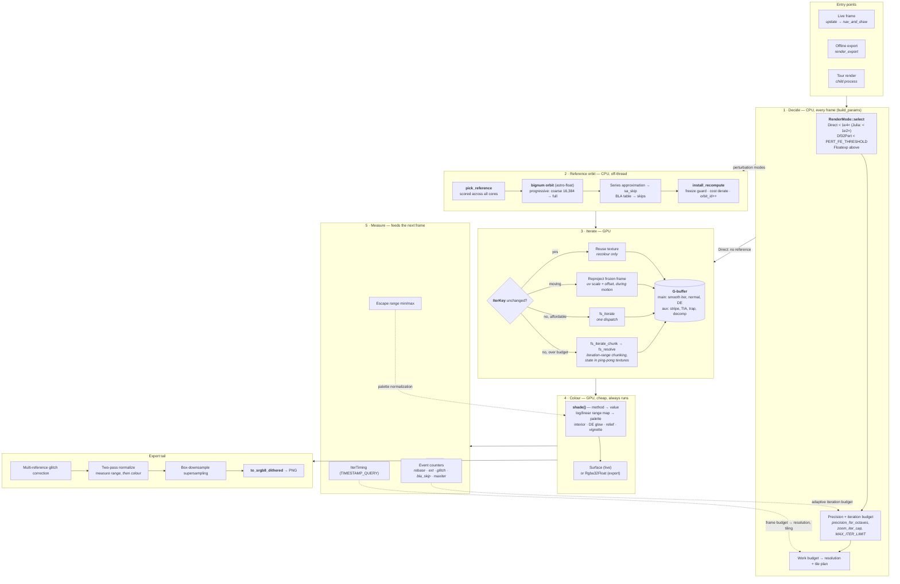

# The rendering pipeline

A map of what happens between "the view changed" and "pixels on screen", and of the feedback loops
that make this the most delicate part of the codebase.

**Why this document exists:** the pipeline's behaviour is spread across `render.rs::build_params`
(1,784 lines), `fractadyne-gpu/src/lib.rs`, and `mandelbrot.wgsl`, and no single file states the
whole shape. It is also the thing a refactor must *not* change — so this describes **behaviour**,
deliberately not code structure. If restructuring `build_params` changes anything in this document,
the refactor changed something it shouldn't have.

Diagram source is Mermaid so it diffs in review and renders on GitHub.

---

## The whole path

---

## The five stages

### 1 · Decide (CPU, every frame)

`RenderMode::select` is **the one place** the numeric representation is chosen — direct df32 from
z₀, df32 perturbation of a reference, or extended-range floatexp perturbation. The Julia crossover
is far lower than Mandelbrot's (1e2 vs 1e4) because a Julia pixel's identity lives only in `z₀`,
entered once, where a Mandelbrot pixel re-injects its `c` every iteration.

Depth then sets bignum precision and the iteration budget, and the measured frame budget sets the
render resolution and tile plan.

### 2 · Reference orbit (CPU, off-thread) — perturbation modes only

The longest silent phase in the app, and the one an out-of-memory abort dies inside. Reference
candidates are **scored across all cores**; the winning point is iterated in arbitrary precision,
**progressively** — a coarse orbit capped at 16,384 iterations lands first so something appears
quickly, then the full orbit replaces it.

⚠ **The progressive build is a recurring source of subtle bugs.** Consumers that watch orbit length
for "has it settled?" see it park at the coarse cap for seconds and conclude the build finished —
which is exactly how `--uitest` came to screenshot iteration-capped previews and produce a
years-long "the deep view is hardware-dependent" mystery (fixed beta.90 by also requiring that no
build is in flight). Anything that waits on this must check the worker, not just the number.

`install_recompute` is likewise load-bearing: installing a long non-escaping partial reference has
historically caused a first-frame device loss and a permanently wedged view.

### 3 · Iterate (GPU)

Four ways to satisfy a frame, in increasing cost:

| path | when | note |
|---|---|---|
| **Reuse** | `IterKey` unchanged | the recolour path — palette/cycle/offset changes never re-iterate |
| **Reproject** | during motion | colour pass samples the frozen texture with a uv scale + offset |
| **`fs_iterate`** | key changed, dispatch affordable | one pass |
| **`fs_iterate_chunk` + `fs_resolve`** | dispatch would exceed the watchdog budget | resumable; per-pixel state ping-pongs through textures across frames |

⚠ `IterKey` and the app-side tile `settings_hash` must change together. A key change the app misses
re-renders only the current tile rect and **splices new-output data into an old-output frame** —
the failure is a subtly wrong image, not a crash.

⚠ The chunked path must stay **bit-identical** to the single-pass one; a selftest check enforces it.
This is what blocked the interior-DE work: adding an estimate to `fs_iterate` alone made the two
disagree.

### 4 · Colour (GPU)

Always runs, and is cheap — which is why recolouring is instant. `shade()` picks the value by
method, maps it to a palette position (linear, or logarithmic when the range is wide), and applies
interior colour, distance glow, relief lighting and the vignette.

### 5 · Measure (the feedback loops)

Three measurements taken from the frame just rendered steer the next one. **These loops are why the
pipeline is delicate**: each is a controller, and a controller tuned at one depth can misbehave at
another.

- **Event counters** → the adaptive iteration budget.
- **Escape range** → live palette normalization.
- **GPU timing** → the frame budget → motion resolution and tiling.

⚠ **The recurring failure shape in this codebase**: a heuristic tuned at one depth fails at the
next. Anything touched here should be checked at e55, e61, e63, e72, e82 and e94 — never at one
depth.

---

## Refactoring against this document

`build_params` performs stage 1 and marshals the results of stage 2 into the GPU job. Splitting it
should preserve every arrow above. The suite is an unusually good guard for that work:

- `chunked direct render is bit-identical` — catches stage-3 divergence,
- 20 bench-matrix path signatures (mode / sa-skip / orbit length / eff-iter / counters) — catch a
  changed *decision* in stage 1,
- 17 golden images — catch a changed pixel,
- `--livetest` — catches the live view disagreeing with an offline render of the same view.

Run all four before and after. A refactor that leaves this document accurate is a good one.

> ### ⚠ One of those four gates is currently unusable for this purpose
>
> `--livetest`'s `hold-e72` checkpoint fails on **any** perturbation of `render.rs`, including
> arithmetic-identical ones. Measured 2026-08-14 over six runs: the pre-refactor baseline and one
> extraction pass three times (`orbit_len` 1,208,193), while two different semantically neutral
> extractions fail three times (`orbit_len` 508,193, hold renders 27% black) — with `eff_iter`
> identical at 1,200,000 throughout, so the decision never changed, only how far the reference got
> in the seconds the hold allows.
>
> The cause is stage 2 racing a wall clock: the hold either finishes a 1.2M-sample reference or
> installs a partial. Frame pacing sits upstream of that race, so a recompile can decide it.
>
> Until that cliff is fixed (TODO.md, "the e72 reference build is on a knife edge"), treat the
> other three gates as the refactor guard and read `hold-e72` as unresolved rather than as a
> verdict. It is a product bug first: a user parked at e72 is one hiccup from the same 27% black.
